# 执行摘要

2026年3月，美国与以色列对伊朗实施联合军事打击，霍尔木兹海峡通行受阻，全球原油市场遭遇自2022年俄乌冲突以来最剧烈的供给侧冲击。布伦特原油从冲突前约72美元/桶飙升至盘中119.50美元，截至3月25日仍报约104美元，月内累计涨幅超过40%，市场估算内含约25-32美元/桶的战争溢价。

**本轮油价飙升的深层原因是"薄缓冲"遭遇"极端冲击"。** OPEC有效剩余产能已从2025年2月的502万桶/日降至2026年2月的320万桶/日（有效部分可能更低），市场对供给中断的吸收能力处于多年低点。在此背景下，霍尔木兹海峡通行受阻导致800-1,000万桶/日的潜在供给损失，远超缓冲上限。IEA成员国释放4亿桶战略储备——史上最大规模联合释储——亦未能将油价压回80美元以下。同期，美联储因油价冲击将2026年PCE通胀预测从2.4%上调至2.7%、推迟降息路径，全球央行同步暂停宽松；Non-OECD经济体需求同比增长129万桶/日，为油价提供了底部支撑。

**后续趋势的核心判断是"Q2见顶、下半年回落、2027年中枢下移"。** 二季度仍受地缘溢价与季节性需求双重支撑，布伦特Q2均价预计落在85-95美元区间。但2026年全年基本面呈现结构性供过于求——EIA口径+187万桶/日、IEA口径+246万桶/日——Q3-Q4供给剩余将从Q2的72万桶/日陡升至222-330万桶/日，OECD商业库存全年净增约1亿桶。过剩压力将驱动布伦特Q4回落至70-80美元区间，2027年中枢进一步下移至60-70美元。概率加权中枢为：Q2约90美元、Q4约73美元、2027年约65美元。

**投资策略方面，建议"短期逐利地缘溢价，中期锚定基本面回归，全程以对冲纪律控制尾部风险"。** 海外市场，炼化板块（VLO/MPC/PSX）受裂解价差结构性走阔支撑，为超配首选；综合油企（XOM/CVX）以标配持有，油服板块（SLB/BKR）适合Q2交易性参与；期货策略可关注近远月日历价差做空及远月合约多头。A股市场，"三桶油"优先级排序为中国海油（油价弹性最大、桶油成本最低）>中国石油（全产业链攻守兼备）>中国石化（下游成本承压）。能源板块仓位建议Q2超配、Q3逐步调降至标配、Q4转为低配，全程配合期权对冲地缘尾部风险。

# 第1章 行情回顾——从长周期下行到地缘冲击性飙升

## 1.1 六年坐标系：2020-2025年布伦特价格的起落周期

把握当前油价所处的历史坐标，需要将视野拉长至六年维度。2020年新冠疫情冲击全球需求，布伦特年均价跌至51美元/桶，创十余年低点；伴随全球经济重启与OPEC+史无前例的减产协议，2021年均价回升至83美元/桶；2022年俄乌冲突推动布伦特年均价飙升至110美元/桶，日内高点一度突破130美元（以2025年不变美元计）。此后地缘溢价逐步消退，2023年均价回落至87美元/桶，2024年维持在83美元/桶，2025年进一步降至69美元/桶，为2020年以来的最低水平[EIA月度数据](https://www.eia.gov/dnav/pet/hist/rbrtem.htm "Europe Brent Spot Price FOB, 2026年3月18日发布")。

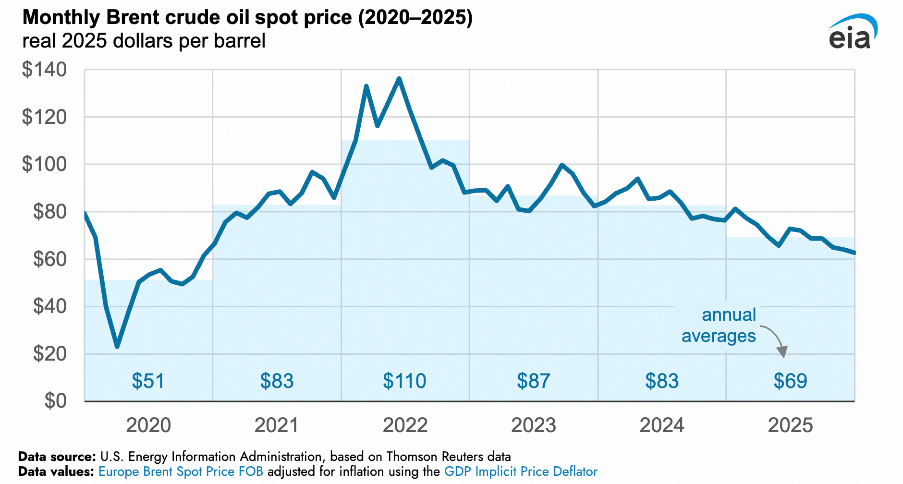

六年曲线清晰勾勒出一个完整的"冲击—修复—回落"周期：2020年需求坍塌构成谷底，2022年地缘冲击形成峰顶，此后三年价格重心逐年下移。2025年Q4均价63美元/桶处于过去五年约15-20%分位的低估值区域[FRED季度数据](https://fred.stlouisfed.org/series/POILBREUSDQ "Global price of Brent Crude")。然而2026年3月战时价格104美元已回到2022年Q2-Q3对应的80-85%分位高位区间——市场在不到一个月内从长周期底部跳跃至历史高位区域。这种断裂式重定价的完整路径，正是本章需要还原的核心线索。

## 1.2 2025年全年下行：四个阶段的逐级失守

2025年布伦特全年均价69美元/桶，月均价从1月的79美元逐步滑落至12月的63美元，全年在60-81美元区间内波动。按季度拆解，Q1均价75.04美元、Q2均价66.96美元、Q3均价68.14美元、Q4均价63.16美元，呈现逐季下行格局[FRED季度数据](https://fred.stlouisfed.org/series/POILBREUSDQ "Global price of Brent Crude")。WTI走势高度同步但价差稳定偏低4-6美元：Q1均价71.81美元、Q2均价64.78美元、Q3均价65.74美元、Q4均价59.65美元[FRED WTI季度数据](https://fred.stlouisfed.org/series/POILWTIUSDQ "Global price of WTI Crude")。

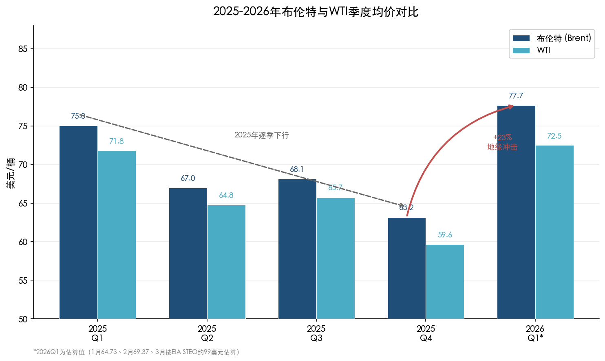

上图将2025年四个季度与2026年Q1（估算值）并列呈现，2025年逐季下行的趋势线与2026年Q1因地缘冲击带来的+23%跳升形成鲜明反差，直观映射出"从长周期下行到冲击性飙升"的断裂式走势。

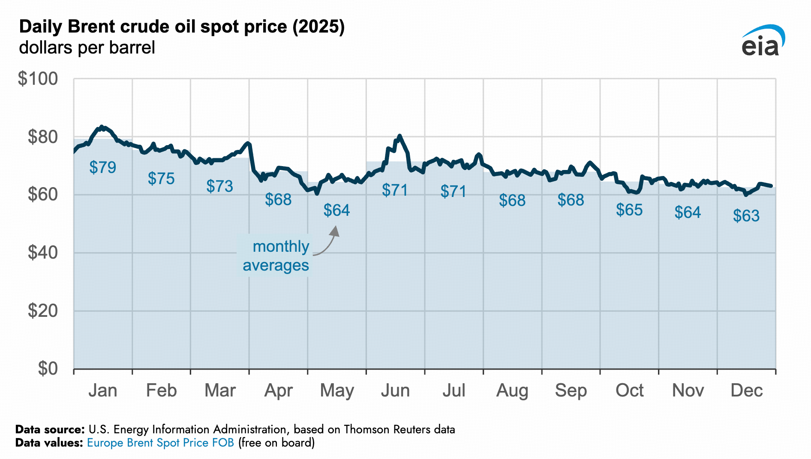

从日度维度进一步拆解，2025年的下行可划分为四个阶段：

**第一阶段（1月）：减产支撑下的高位平台。** 年初布伦特月均79美元/桶，OPEC+延续2024年以来的自愿减产安排，供给端维持偏紧格局，油价暂获支撑。

**第二阶段（2-5月）：多重利空的累积下跌。** 布伦特从2月的75美元一路下滑至5月的64美元，累计跌幅逾19%。三重利空交织：OPEC+于4月宣布逐步增产，打破此前的供给收缩预期；美国一季度GDP录得负增长，宏观衰退叙事升温；特朗普政府升级对华关税，全球贸易前景恶化。压力层层叠加之下，地缘政治溢价几乎消失殆尽[Reuters专栏](https://www.reuters.com/markets/commodities/oils-geopolitical-premium-vanished-2025-may-not-return-2025-12-22/ "Oil's geopolitical premium vanished in 2025")。

**第三阶段（6-7月）：短暂的地缘反弹。** 6月以色列对伊朗核设施实施空袭，中东紧张局势骤然升级，布伦特月均回升至71美元/桶。然而这轮冲突仅持续约两周即达成停火，地缘溢价快速消退，7月均价勉强维持在71美元附近。

**第四阶段（8-12月）：增产与累库的阴跌通道。** OPEC+在下半年持续推进增产计划，全球库存大幅累积，布伦特月均价从8月的68美元一路滑落至12月的63美元。WTI 12月月均仅58美元/桶，回到疫情后最低水平。年末市场情绪极度悲观，"地缘溢价归零"成为卖方共识。

## 1.3 2026年1-2月：弱势筑底中的温和反弹

进入2026年，油价在低位展现出一定韧性。1月布伦特月均64.73美元/桶，WTI月均60.26美元/桶，仍处于2025年Q4的价格中枢附近。2月温和回暖信号逐步显现：布伦特月均升至69.37美元/桶，环比上涨7.17%；WTI月均64.52美元/桶，环比上涨7.07%[NYMEX/ICE月周均价表](assets/data/images/screenshot-20260325-143021.png "2026年2月WTI/Brent月周均价数据")。

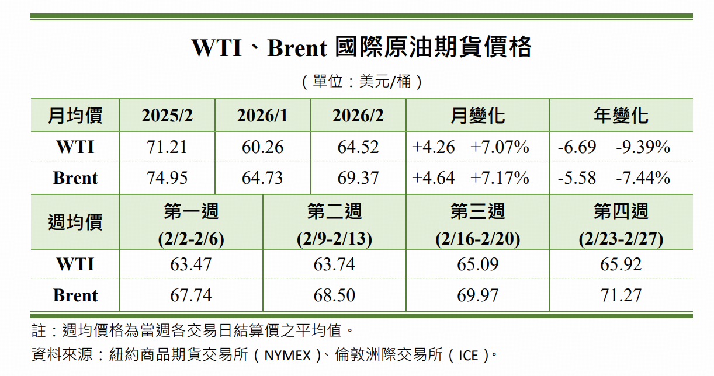

周度数据揭示了反弹的微观节奏：布伦特第一周（2/2-2/6）均价67.74美元，第二周68.50美元，第三周69.97美元，第四周71.27美元，逐周走强且呈加速态势。WTI同步走出63.47→63.74→65.09→65.92美元的台阶式上行。

然而"环比强、同比弱"的特征值得警惕——布伦特2月同比仍下跌7.44%，WTI同比下跌9.39%。2月的反弹本质上是2025年深度下跌后的技术性修复，尚不足以扭转长期趋势方向。站在2月底的时点，市场主流预期仍将布伦特全年中枢锚定在60-70美元区间，供过于求的基本面格局并未出现实质性转变。谁也未曾料到，一场地缘风暴即将在数日之内彻底颠覆这一共识。

## 1.4 2026年3月：战争溢价的断裂式冲击

2月28日至3月1日，美国与以色列对伊朗发动联合军事打击，中东地缘格局骤然改变，油价随之进入一段史诗级的波动区间。这是自2022年俄乌冲突以来全球原油市场遭遇的最剧烈供给侧冲击。

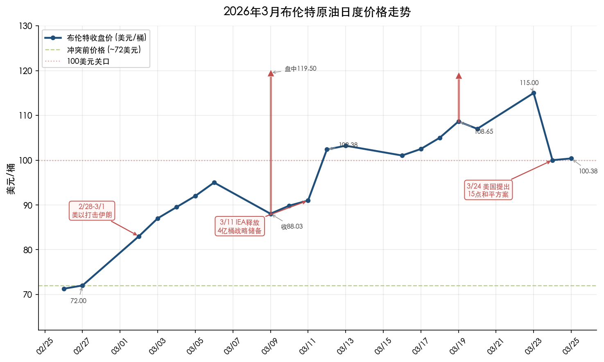

上图完整呈现了2月底至3月25日布伦特收盘价的日度走势及关键事件节点。从冲突前约72美元/桶的起点出发，布伦特在不到两周内突破100美元关口，盘中两度触及119美元附近，随后在百元上方展开高位拉锯。以下按周度拆解这一轮冲击的完整路径。

**第一周（3月1-7日）：恐慌定价与极端波动。** 军事行动消息传出后，市场恐慌情绪迅速蔓延。霍尔木兹海峡通行风险急剧上升——全球约五分之一的石油贸易依赖这一咽喉要道——分析师估计有效供给损失可能达到800万-1,000万桶/日[Axios报道](https://www.axios.com/2026/03/01/iran-strikes-oil-prices-opec "OPEC producers boost output after Iran strikes")。OPEC+紧急宣布增产20.6万桶/日，但相对于潜在的供给缺口杯水车薪。布伦特在开市首日即大幅跳升[NPR报道](https://www.npr.org/2026/03/01/nx-s1-5731584/oil-prices-iran-us-israel-attacks-war "Oil prices rise sharply, Mar 2026")。

**第二周（3月8-14日）：触及120美元的极端高点与IEA历史性干预。** 3月9日（周一），伊朗宣布霍尔木兹海峡保持关闭，布伦特亚太交易时段盘中飙升至119.50美元/桶，WTI一度接近同等水平，为2022年夏季以来的最高价位[LA Times报道](https://www.latimes.com/world-nation/story/2026-03-08/crude-oil-prices-surpass-100-barrel-as-iran-war-impedes-production-shipping "Brent surges to $119.50, Mar 9 2026")。当日G7紧急释放战略储备的消息传出后，价格大幅回落——布伦特收盘暴跌至88.03美元/桶，日内振幅超过30美元[USA Today报道](https://www.usatoday.com/story/money/2026/03/09/oil-100-trump-gas-prices-iran-war/89063180007/ "Brent reversed to $88.03 on Mar 9")。3月11日，IEA成员国宣布释放4亿桶战略石油储备，为有史以来规模最大的联合释储行动，其中美国承担1.72亿桶（SPR释放），占总量的43%[IEA公告](https://www.iea.org/news/iea-member-countries-to-carry-out-largest-ever-oil-stock-release-amid-market-disruptions-from-middle-east-conflict "IEA largest ever oil stock release, Mar 11 2026")。这一举措暂时稳定了市场信心，但布伦特3月12日仍收于100.46美元/桶，为四年来首次站上100美元[CNBC报道](https://www.cnbc.com/2026/03/12/oil-prices-jump-iea-record-reserve-release-markets-doubt-relief.html "Brent hits $100 after Iran says Strait of Hormuz to remain closed")。

**第三周（3月15-21日）：百元上方的高位拉锯。** FRED日度数据显示，布伦特3月10日收于89.84美元、11日90.98美元、12日102.38美元、13日103.23美元、16日101.04美元[FRED日度数据](https://fred.stlouisfed.org/series/DCOILBRENTEU "Crude Oil Prices: Brent - Europe")。随后伊朗威胁无限期关闭霍尔木兹海峡与特朗普发出最后通牒相互交织，布伦特3月19日盘中再度冲高至119美元附近，收盘报108.65美元[Reuters报道](https://www.reuters.com/business/energy/oil-rises-3-after-iran-strikes-middle-east-energy-facilities-2026-03-19/ "Brent settles at $108.65, Mar 19")。3月20日布伦特收于约107美元，市场维持百元上方高位震荡。Fitch评级警告，若霍尔木兹海峡关闭持续六个月，布伦特年均价可能达到120美元/桶，极端情形下峰值或触及130-170美元[Fitch Ratings](https://www.fitchratings.com/research/corporate-finance/oil-prices-could-average-usd120-bbl-if-hormuz-closed-for-six-months-20-03-2026 "Oil Prices Could Average USD120/bbl If Hormuz Closed for Six Months")。

**第四周（3月22-25日）：和谈传闻下的剧烈波动。** 3月23日布伦特收盘升至约115美元/桶，但3月24日形势急转——美国向伊朗提出15点和平方案的消息传出，油价单日暴跌逾6%，布伦特回落至100美元附近[Reuters报道](https://www.reuters.com/business/energy/us-oil-prices-fall-prospect-middle-east-ceasefire-easing-supply-disruption-2026-03-24/ "Oil prices drop 4% as US proposes 15-point plan to Iran for peace")。伊朗随即否认与美国存在直接谈判，油价3月25日再度剧烈波动。截至3月25日，布伦特现货报约100-104美元/桶，较冲突前仍上涨约40-45%，市场估算内含约25-32美元/桶的战争溢价[MiddleEastInsider](https://themiddleeastinsider.com/2026/03/25/oil-price-today-march-25-2026-brent-wti-rebound-104-peace-hopes-fade/ "Brent $104.49, Mar 25 2026")。Trading Economics数据显示布伦特3月25日报100.38美元/桶，较前日下跌3.94%，但过去一个月累计涨幅仍高达41.69%[Trading Economics](https://tradingeconomics.com/commodity/brent-crude-oil "Brent crude oil price, Mar 25 2026")。

## 1.5 机构预测：战争之下的巨大分歧

3月的冲击使得主要机构的油价预测出现罕见的巨大分歧，折射出市场对"战争溢价能否持续"这一核心问题的根本性分歧。

EIA在2026年3月发布的短期能源展望（STEO）中大幅上修预测，将布伦特2026年Q2均价调至90.56美元/桶，3月单月预测高达99美元/桶；但EIA同时预计下半年油价将随地缘紧张缓解而逐步回落，Q3降至75.45美元/桶，Q4进一步降至70美元/桶，全年均价78.84美元/桶，2027年均价回落至64.47美元/桶。EIA的预测本质上是一条"冲击—消退"路径——承认地缘冲击造成的价格跳升，但预期下半年回归基本面驱动。

与此形成鲜明对比的是，Thomson Reuters 2月底发布的预测（尚未纳入3月伊朗冲突）呈现截然不同的图景：布伦特2026年各季度均价在63.5-64.5美元区间窄幅波动，全年均价仅63.85美元/桶，2027年均价65.06美元/桶。Thomson Reuters的预测完全锚定供过于求的基本面，隐含的核心假设是冲突不会造成持久的供给破坏。两大机构全年均价预测的差距达到15美元/桶，Q2峰值差距更高达27.1美元/桶[EIA与TR油价展望对比表](assets/data/images/screenshot-20260325-143030.png "国际油价展望EIA vs TR")。

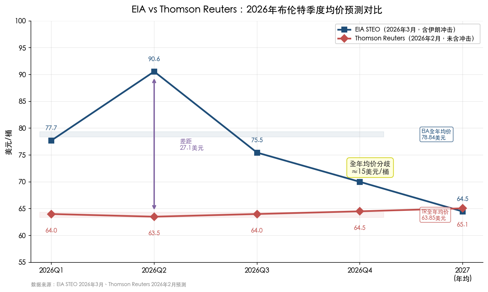

WTI方面同样存在类似分歧：EIA预测2026年全年均价73.61美元/桶（3月高达91美元），Thomson Reuters预测仅60.38美元/桶。两种路径的抉择，将直接决定未来半年至一年的投资逻辑与资产配置方向。

## 1.6 小结：从数据基准到分析框架

回顾过去一年，油价经历了三个截然不同的阶段：2025年的长周期下行（布伦特从79美元降至63美元），2026年1-2月的温和筑底反弹（布伦特回升至69美元），以及2026年3月美以打击伊朗引发的断裂式飙升（布伦特从72美元飙至盘中119.50美元，截至3月25日仍处于100美元附近）。当前约104美元的价格水平与2025年Q4均价63美元相比已上涨逾60%，但与2022年俄乌冲突后的峰值相比仍有差距，且市场内嵌的25-32美元战争溢价具有高度不确定性。

上述价格事实构成后续分析的数据基准。核心矛盾已清晰呈现：短期地缘冲击将油价推至多年高位，而中长期基本面——OPEC+增产、全球需求放缓、供过于求的预期——仍指向一个显著低于当前价位的均衡水平。两股力量的角力如何演绎，正是下一章将深入拆解的主题。

# 第2章 短期反弹的深层驱动——供给扰动、地缘溢价与宏观重定价

第1章已完整还原了从2025年长周期下行到2026年3月战争冲击的价格事实。布伦特在不到一个月内从72美元飙升至盘中119.50美元，截至3月25日仍报约104美元——这一断裂式行情的驱动力绝非单一因素所能解释。本章从四个维度拆解反弹的深层逻辑：OPEC剩余产能的结构性收窄、地缘政治溢价的历史传导规律与当前风险敞口、美联储利率曲线重定价对大宗商品的传导效应，以及Non-OECD经济体季节性需求回暖的支撑。我们认为，2026年3月的油价暴涨是"薄缓冲"遭遇"极端冲击"的必然结果，而非偶然的市场失控。

## 2.1 OPEC剩余产能的结构性收窄——"安全垫"薄至危险水平

理解本轮油价飙升的烈度，必须首先审视一个容易被市场忽视的底层变量：OPEC的有效剩余产能。

根据EIA 2026年3月STEO数据，2026年2月OPEC总剩余产能已降至320万桶/日，较2025年2月的502万桶/日下降182万桶/日，降幅达36.3%[EIA STEO OPEC产能数据](assets/data/images/screenshot-20260325-143056.png "OPEC石油供给量及产能概况，EIA 2026年3月")。收窄速度远超市场预期，主要受两方面因素驱动：

**其一，OPEC+自2025年4月启动的渐进式增产消耗了大量闲置产能。** 以沙特为例，2026年2月产量已达1,020万桶/日，较2025年2月增加135万桶/日（+15.3%），增产空间被大幅压缩。阿联酋同期产量从316万桶/日升至358万桶/日，增幅13.3%[EIA STEO OPEC产能数据](assets/data/images/screenshot-20260325-143056.png "OPEC各国产量与产能变动")。

**其二，EIA于2025年12月更新了OPEC产能的定义方法，将"最大可持续产能"与"有效产能"做了更严格的区分。** 新定义下的"有效产能"要求90天内可达到并可持续运转，排除了因基础设施老化、油田成熟衰减等原因无法实际动用的"纸面产能"[EIA产能定义更新](https://www.eia.gov/todayinenergy/detail.php?id=66904 "EIA updates definitions of OPEC crude oil production capacity, Dec 2025")。这一方法论调整使得市场惯常引用的"OPEC剩余产能500万桶以上"的叙事大打折扣。考虑到伊拉克、尼日利亚等国长期存在产量执行不达标的问题，实际可在短期内调动的有效产能可能仅为账面数字的60%左右[Kingdom Exploration分析](https://www.kingdomexploration.com/?page=news&article=eia-opec-capacity-redefinition-january-2026-supply-crisis "EIA Reveals Spare Capacity 60% Lower Than Reported")。

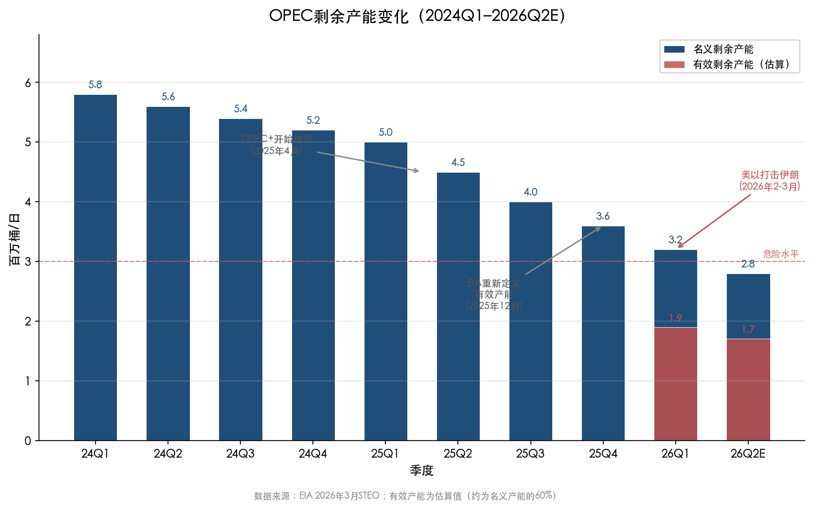

上图清晰呈现了OPEC名义剩余产能从2024Q1的580万桶/日逐步收窄至2026Q2E的280万桶/日的路径。红色柱体所示的有效剩余产能（约为名义值的60%）在2026Q1仅190万桶/日，已远低于市场共识中的"安全垫"水平。

**剩余产能收窄的定价含义极为深远。** EIA在产能报告中明确指出："低剩余产能会在非计划供给中断或需求强劲增长的情况下对油价施加上行压力。"当安全垫从500万桶/日收缩至320万桶/日（有效部分可能更低）时，任何供给扰动的价格放大效应都将成倍增加。2026年2月底美以打击伊朗，恰恰是一个极端的供给中断场景叠加于薄缓冲市场之上——分析师估计有效供给损失达800至1,000万桶/日[Axios报道](https://www.axios.com/2026/03/01/iran-strikes-oil-prices-opec "OPEC producers boost output after Iran strikes")，远超OPEC剩余产能的极限，油价飙升至120美元的烈度由此可得解释。

从长期视角观察，问题同样值得关注。John Kemp在Reuters专栏中指出，剩余产能持续收窄有助于解释为何长端期货价格（2028-2030年交割合约）相对稳定在65-70美元区间，即便近月合约因地缘冲击剧烈波动[Reuters Kemp专栏](https://www.linkedin.com/posts/john-kemp-4275063_opec-shrinking-spare-capacity-supports-long-term-activity-7383861191187668993-5ZIa "OPEC+ shrinking spare capacity supports long-term oil prices")。这意味着市场对中长期供给弹性的信心正在被侵蚀——一旦缓冲耗尽，任何新的冲击都将引发更剧烈的价格波动。

## 2.2 地缘政治溢价的传导规律——历史镜鉴与当前风险敞口

### 2.2.1 历史地缘冲击的价格传导模式

回顾过去半个世纪的主要石油地缘冲击，可以发现一组清晰的历史规律：

**1973年阿拉伯石油禁运：** 供给缩减约5%，油价从3美元/桶涨至12美元/桶（+300%），冲击持续约6个月，直接引发西方经济衰退。

**1979年伊朗革命：** 伊朗日产500万桶的产能骤然崩塌，油价从14美元升至30美元以上（+114%），冲击持续超过12个月，叠加其后的两伊战争形成了长达数年的高油价周期。

**1990年海湾战争：** 伊拉克入侵科威特导致两国约430万桶/日出口中断，油价从15美元飙升至42美元（+180%），但联军快速军事干预后油价在6个月内回落至冲突前水平[Gulf News历史回顾](https://gulfnews.com/business/energy/anatomy-of-oil-shocks-what-historical-data-shows-about-key-geopolitical-moments-1.500472984 "Anatomy of oil shocks: historical data on geopolitical moments")。

**2011年利比亚内战：** 150万桶/日产量中断，油价涨至114美元（+35%），但沙特迅速增产弥补缺口，冲击在3至4个月内消退。

**2022年俄乌冲突：** 布伦特从冲突前约90美元升至盘中130美元以上（+44%），但在IEA协调释放战略储备及俄油通过"影子船队"持续流入市场后，价格在6个月内回落至冲突前水平附近。

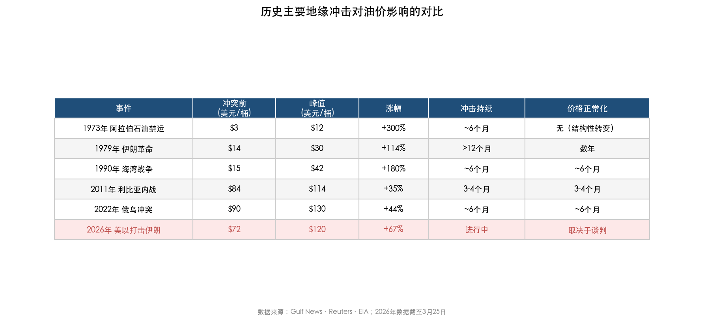

上表系统对比了六次重大地缘冲击的油价影响参数。2026年美以打击伊朗事件的涨幅（+67%）在历史序列中处于中高水平，但霍尔木兹海峡通行风险赋予本轮冲击前所未有的潜在损失规模。

从J.P. Morgan的历史产量冲击指数化对比中亦可观察到，不同冲击事件后的产量恢复路径差异巨大：伊拉克（2003年）和利比亚（2011年）经历了剧烈下跌后的逐步恢复；伊朗（1979年）则呈现持续下滑态势；而阿尔及利亚（2019年）和"铁剑行动"（2023年）的影响甚微[J.P. Morgan产量冲击对比图](assets/data/images/screenshot-20260325-140909.png "历史政治动荡后各国产量恢复指数，J.P. Morgan Commodities Research")。

综合历史经验，可以提炼出三条规律：**第一，** 涉及霍尔木兹海峡等咽喉要道的冲击，其价格放大效应远高于单一产油国的产量中断；**第二，** 冲击的持续时间比初始烈度更重要——短促的军事行动（如1990年海湾战争）通常在3至6个月内完成价格正常化，而涉及政权更迭或结构性产能破坏的事件（如1979年伊朗革命）则可能形成多年的高油价周期；**第三，** 战略石油储备的释放和OPEC剩余产能的动用是终结溢价的关键阀门。

### 2.2.2 2026年3月冲击的特殊性与溢价结构

将上述历史框架应用于当前局势，2026年3月的美以打击伊朗冲击具有几个区别于以往的显著特征：

**风险敞口前所未有。** 霍尔木兹海峡承载全球约五分之一的石油贸易，日均通行量在冲突前为100至135艘油轮[Gulf News航运数据](https://gulfnews.com/business/energy/anatomy-of-oil-shocks-what-historical-data-shows-about-key-geopolitical-moments-1.500472984 "Strait of Hormuz daily transits before conflict: 100-135")。冲突爆发后，3月上半月仅约90艘船只通过海峡，海运保险费率飙升，实际可用运力大幅萎缩。与1990年海湾战争中受冲击的伊拉克-科威特产能（430万桶/日）相比，本轮潜在供给损失规模高出一倍以上。

**溢价水平已获市场定量标定。** 截至3月25日，市场估算布伦特内含约25至32美元/桶的战争溢价[MiddleEastInsider](https://themiddleeastinsider.com/2026/03/25/oil-price-today-march-25-2026-brent-wti-rebound-104-peace-hopes-fade/ "Brent $104.49, war premium estimated at $25-32/bbl")。特朗普政府顾问3月16日亦公开表示，伊朗紧张局势历史上曾为油价嵌入5至15美元/桶的"恐怖溢价"，而当前冲突已将这一溢价推至历史极值[Reuters报道](https://www.reuters.com/business/energy/trump-adviser-says-iran-terror-premium-inflated-oil-prices-decades-2026-03-16/ "Trump adviser: Iran terror premium inflated oil prices for decades")。

**终结溢价的两个阀门均面临约束。** 3月11日IEA成员国宣布释放4亿桶战略石油储备（其中美国承担1.72亿桶），这是有史以来规模最大的联合释储行动，但仍未能将油价压回80美元以下——布伦特在释储公告后依然站稳100美元上方[IEA公告](https://www.iea.org/reports/oil-market-report-march-2026 "IEA member countries agreed to release unprecedented 400 mb of oil")。OPEC端，剩余产能仅320万桶/日（有效部分可能更低），即便全部释放也无法弥补霍尔木兹海峡完全关闭所造成的800至1,000万桶/日缺口。OPEC+紧急增产的20.6万桶/日相对于潜在损失近乎杯水车薪。

我们判断，地缘溢价的消退速度将高度取决于霍尔木兹海峡的通行恢复进度和3月28日谈判的实质性进展。历史经验表明，一旦通行恢复的明确信号出现，地缘溢价的消退往往非常迅速——1990年海湾战争中，联军取得决定性军事胜利后油价在两个月内即回到冲突前水平。但若通行持续受阻，Fitch警告布伦特年均价可能达到120美元，极端情形峰值或触及130至170美元。

## 2.3 FOMC利率曲线重定价——从宽松预期到"更高更久"的U型回转

2026年3月的油价冲击不仅直接推高了能源价格，还通过通胀预期渠道深刻改变了美联储的政策路径和利率曲线形态，而利率环境的变化又反过来影响了大宗商品的定价逻辑。

### 2.3.1 FOMC 3月决议：鹰派转向的关键时刻

美联储在3月17-18日的FOMC会议上以11:1投票维持联邦基金利率于3.50%-3.75%区间不变[CNBC报道](https://www.cnbc.com/2026/03/18/fed-interest-rate-decision-march-2026.html "Fed interest rate decision March 2026: Holds rates steady")。表面上利率不变并不令人意外，但本次会议的真正重要性在于三个鹰派信号：

**第一，通胀预测大幅上修。** 经济预测摘要（SEP）将2026年PCE通胀预测从此前的2.4%上调至2.7%，为2022年6月以来最大幅度的单次上调[Mariemont Capital分析](https://mariemontcapital.com/fomc-march-2026-treasury-yields-oil-shock/ "FOMC March 2026: PCE inflation forecast raised to 2.7%")。该调整直接反映了中东冲突对能源成本传导的预期。

**第二，点阵图分布明显右移。** 虽然中位数仍显示2026年降息一次（25个基点），但19位与会者中已有7位认为年内不应降息，较12月的6位进一步增加[J.P. Morgan FOMC解读](https://am.jpmorgan.com/us/en/asset-management/liq/insights/portfolio-insights/fixed-income/fixed-income-perspectives/fomc-statement-march-2026/ "FOMC voted to keep rate at 3.50-3.75%")。鲍威尔在记者会上坦承"通胀进展不及预期"。

**第三，理事Waller的关键表态。** Waller透露原本计划投票支持降息，但被油价冲击的通胀影响所说服而改变立场。他表示，若油价持续处于高位，其对通胀的影响将具有"非暂时性"特征——这一措辞与2021-2022年美联储低估通胀的"暂时性"论调形成了鲜明的政策纠偏[Mariemont Capital分析](https://mariemontcapital.com/fomc-march-2026-treasury-yields-oil-shock/ "Gov. Waller: prolonged elevated oil prices would have non-transitory impact")。

### 2.3.2 收益率曲线的前端主导型熊平

FOMC会议前后一周，美国国债收益率曲线出现典型的"前端主导型熊市趋平"（Front-End Led Bear Flattening）：

| 期限 | 3月13日 | 3月20日 | 周变动 |
|------|---------|---------|--------|
| 2年期 | 3.72% | 3.90% | +18bp |
| 5年期 | 3.86% | 4.03% | +17bp |
| 10年期 | 4.28% | 4.39% | +11bp |
| 30年期 | 4.91% | 4.96% | +6bp |

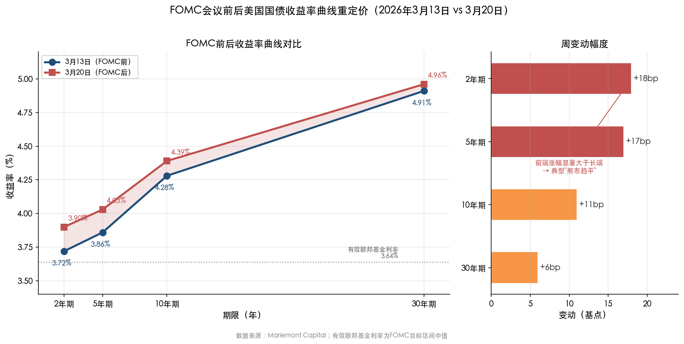

上图左侧面板对比了FOMC前后收益率曲线的整体上移，右侧面板则以水平柱状图呈现各期限的周变动幅度，"前端涨幅显著大于长端"的熊平特征一目了然。

数据来源：[Mariemont Capital](https://mariemontcapital.com/fomc-march-2026-treasury-yields-oil-shock/ "Duration Dashboard, Mar 13-20 2026")

2年期收益率单周上行18个基点至3.90%，超过了3.64%的有效联邦基金利率，为2023年11月以来首次——意味着市场已从"定价宽松"转向"定价可能进一步收紧"[Mariemont Capital分析](https://mariemontcapital.com/fomc-march-2026-treasury-yields-oil-shock/ "2-year yield rose above effective fed funds rate for first time since Nov 2023")。至3月20日收盘，联邦基金期货已完全抹去2026年的降息预期，首次完全定价的25个基点降息被推迟至2027年末[Bloomberg报道](https://www.bloomberg.com/news/articles/2026-03-20/bond-market-s-big-2026-fed-bet-flipped-on-its-head-by-oil-surge "Bond traders scrapped 2026 Fed cut bets as oil surge fuels inflation fears")。部分交易员甚至开始为10月前加息的可能性定价。

30年期收益率4.96%处于5年区间的98%分位，反映了持续通胀风险、高额财政赤字（年化超1.9万亿美元）和地缘不确定性共同推高的期限溢价。

### 2.3.3 利率重定价对油价的双向传导

利率环境变化通过三个渠道影响油价：

**美元渠道：** 利率上行在理论上应推高美元从而压制以美元计价的大宗商品。但3月第三周DXY指数反而下跌约1%至99.50附近，原因在于欧央行、英央行同步转鹰（ECB将2026年通胀预测上调至2.6%，BOE警告CPI可能升至3.0%-3.5%），削弱了美国的利差优势。美元走弱反而为油价提供了额外的计价支撑。

**通胀预期渠道：** 5年期盈亏平衡通胀率自冲突爆发以来显著上升，市场已将能源成本上涨嵌入中长期通胀预期。这降低了实际利率的上升幅度（名义利率上升但通胀预期同步上行），减弱了利率对大宗商品的压制效应。

**全球央行同步暂停渠道：** 3月第三周，美联储、欧央行、英央行和日本央行在24小时内先后公布利率决议，无一降息——这标志着2024年末至2025年的全球宽松周期正式终结[Mariemont Capital分析](https://mariemontcapital.com/fomc-march-2026-treasury-yields-oil-shock/ "Fed, ECB, BOE, BOJ all held rates within 24 hours — none cut")。全球利率路径的"更高更久"意味着经济增长预期面临下修，但在供给端受到实质性约束的背景下，需求放缓的利空不足以抵消供给中断的利多。短期内，油价对供给冲击的敏感度远高于对需求放缓的敏感度。

## 2.4 Non-OECD需求回暖——季节性支撑与结构性增量

供给端和宏观面之外，需求端的边际改善构成了油价反弹的第三根支柱。

### 2.4.1 全球需求增长的"新兴市场驱动"格局

根据EIA 2026年3月STEO，2026年2月全球石油消费为10,514万桶/日，同比增加201万桶/日。需求增长的结构性特征十分鲜明：Non-OECD经济体消费5,870万桶/日，同比增加129万桶/日，贡献了全球增量的64%；OECD经济体消费4,644万桶/日，同比增加72万桶/日[EIA STEO需求数据](assets/data/images/screenshot-20260325-143048.png "全球石油消费OECD与Non-OECD分布")。

从主要国家看，中国2月石油消费1,697万桶/日，印度604万桶/日，两国合计占Non-OECD需求增量的大部分。IEA 2月月报预测2026年全球需求增长85万桶/日（高于2025年的77万桶/日），其中Non-OECD经济体贡献绝大部分增量[IEA 2月月报](https://www.iea.org/reports/oil-market-report-february-2026 "Global oil demand forecast to rise by 850 kb/d in 2026, non-OECD accounts for bulk")。OPEC的预测更为乐观，给出2026年全球需求增长约140万桶/日的估计，其中Non-OECD增长超过120万桶/日，亚洲为核心驱动力[OPEC月报](https://www.facebook.com/OPECSecretariat/posts/in-2026-global-oil-demand-is-forecast-to-grow-by-about-14-mbd-y-o-y-unchanged-fr/1151723297107368/ "OPEC forecasts 1.4 mb/d global oil demand growth in 2026")。

### 2.4.2 季节性因素的短期支撑

2026年一季度需求的环比改善还受益于北半球冬季取暖季的尾部效应和亚洲经济体春节后的工业复产。EIA数据显示，2月全球消费环比增加203万桶/日，其中OECD环比增113万桶/日、Non-OECD环比增90万桶/日，OECD在一季度的季节性回升幅度甚至更大。然而，这种季节性支撑的可持续性有限——根据EIA季度预测，全球消费将从Q1的10,394万桶/日逐步攀升至Q3的10,603万桶/日（季节性旺季），但供给增长的斜率更为陡峭，供需缺口将在Q3-Q4显著扩大[EIA季度预测数据](assets/data/images/screenshot-20260325-143106.png "全球石油消费、供给、供给剩余季度预测")。

### 2.4.3 印度崛起与中国"天花板"

需求增长的结构性迁移同样值得关注。S&P Global预计中国2026年石油需求增长仅约1%，与增长停滞无异[S&P Global](https://www.spglobal.com/ratings/en/regulatory/article/2026-outlook-china-commodities-watch-upstream-stays-firm-br--s101655273 "China oil demand to edge up just 1% in 2026")。电动车渗透率的快速提升和经济结构向服务业转型正在侵蚀中国的边际石油需求。而印度则被OPEC世界石油展望列为未来全球石油需求增长的最大贡献者[OPEC WOO](https://www.pib.gov.in/PressReleasePage.aspx?PRID=2219796&reg=3&lang=2 "India projected as largest contributor to global oil demand growth till 2050")，部分分析师甚至预计印度的基础需求增量将在2026年超过中国。这种"接力棒"的传递意味着，全球石油需求增长虽不至断崖下跌，但增速重心正从体量最大的中国转向增速更高的印度和东南亚，其需求弹性和政策不确定性特征均有所不同。

## 2.5 四重驱动的合力与交互——为何此时反弹、为何如此剧烈

综合上述四个维度，2026年初油价反弹的底层逻辑可凝练为一个"薄缓冲+极端冲击+宏观固化+需求托底"的四因子框架：

**OPEC剩余产能收窄（薄缓冲）：** 名义剩余产能从502万桶/日降至320万桶/日，有效产能可能更低，市场对供给中断的"吸收能力"处于多年低点。

**霍尔木兹海峡危机（极端冲击）：** 潜在供给损失800至1,000万桶/日远超缓冲上限，即便史上最大规模的联合释储（4亿桶）和OPEC紧急增产亦不足以弥补。

**全球利率"更高更久"（宏观固化）：** 美联储因油价冲击上修通胀预测、推迟降息，全球央行同步暂停宽松，利率曲线熊平压缩了经济增长预期，但在供给约束下需求放缓的利空弱于供给中断的利多。

**Non-OECD需求季节性回暖（需求托底）：** 全球需求同比增长200万桶/日，新兴市场贡献六成以上增量，为油价提供了底部支撑。

上述四个因素并非简单的线性叠加，而是存在非线性的交互放大效应。当剩余产能充裕时（如2019年OPEC有效剩余产能超过350万桶/日），地缘冲击即使发生也会被迅速吸收——2023年"铁剑行动"期间油价波动甚微即为明证。但当剩余产能收窄至危险水平时，同等规模的供给冲击会引发成倍的价格反应，而油价飙升又通过通胀渠道锁定宏观政策空间（央行无法降息对冲经济放缓），进而加剧金融市场的波动。

我们认为，理解这一交互机制对于判断后续走势至关重要：地缘溢价的消退取决于霍尔木兹海峡的通行恢复，但即便溢价完全消除，市场仍面临剩余产能偏低、供需基本面走向过剩的矛盾。这种"短期极端紧张 vs 中期结构性过剩"的张力，将在第3章供需基本面的全景分析中得到进一步展开。

# 第3章 供需基本面全景——2026年全年供过于求的格局

第2章拆解了本轮油价反弹的四重短期驱动力。然而，当分析视角从地缘冲击的脉冲式扰动转向全球石油市场的基本面结构时，一幅截然不同的图景浮现：2026年全年供给持续大于需求，供过于求是贯穿始终的底色。本章从EIA 2026年3月STEO的全球供需平衡表出发，系统拆解供给端OPEC与Non-OPEC双线扩张、需求端OECD与Non-OECD分化格局，以及Q3-Q4加速累库的路径斜率，为后续趋势研判提供最核心的基本面锚。

## 3.1 全球供需平衡表：+274万桶/日的结构性过剩

### 3.1.1 2026年2月的供需快照

EIA 2026年3月STEO数据显示，2026年2月全球石油总供给10,788万桶/日，总消费10,514万桶/日，供给剩余达+274万桶/日[全球石油消费、供给概况表](assets/data/images/screenshot-20260325-143038.png "EIA 2026年3月STEO数据")。该过剩规模相当于全球日需求的2.6%，意味着市场每天有近280万桶的多余产出需被库存吸收。

与一年前相比，供需两端增长速度高度不对称：供给侧同比增加457万桶/日（+4.42%），其中OPEC贡献225万桶/日（+6.85%），Non-OPEC贡献232万桶/日（+3.29%）；需求侧同比仅增201万桶/日（+1.95%）。供给增速是需求增速的两倍有余，这种"剪刀差"构成供过于求格局形成的根本原因。

即便在2026年1月——OPEC+暂停增产的首月——供给剩余仍高达288万桶/日。2月OPEC恢复增产后剩余略降至274万桶/日，依旧处于历史高位。作为参照，2025年2月供给剩余仅18万桶/日，市场彼时接近平衡。从18万桶/日飙升至274万桶/日，量级跃升深刻改变了市场定价逻辑。

### 3.1.2 季度预测：Q3-Q4加速宽松

EIA季度预测揭示了一条更值得关注的路径：2026年供过于求的压力将在下半年显著加大。

| 指标 | 2026 Q1 | 2026 Q2 | 2026 Q3 | 2026 Q4 | 2025全年 | 2026全年 |
|------|---------|---------|---------|---------|---------|---------|
| 总消费（百万桶/日） | 103.94 | 105.07 | 106.03 | 105.62 | 103.94 | 105.17 |
| 总供给（百万桶/日） | 105.14 | 105.78 | 108.25 | 108.92 | 106.31 | 107.04 |
| 供给剩余（百万桶/日） | +1.20 | +0.72 | +2.22 | +3.30 | +2.36 | +1.87 |
| OECD商业库存（百万桶） | 2,833 | 2,851 | 2,892 | 2,937 | 2,838 | 2,937 |

数据来源：[EIA STEO 2026年3月](assets/data/images/screenshot-20260325-143106.png "全球石油消费、供给、供给剩余季度预测")

上述数据揭示三个关键特征：

**第一，Q2是全年供给压力最轻的窗口。** 二季度供给剩余仅72万桶/日，为四季度中最低。这主要因为需求季节性回升（从Q1的103.94升至105.07百万桶/日），而供给端增长尚未完全兑现。Q2恰好也是地缘冲击仍在发酵的阶段，二季度高油价同时获得供需面和地缘面的双重支撑——但这种支撑是暂时的。

**第二，Q3-Q4供给增速跳升，过剩急剧扩大。** Q3总供给从Q2的105.78百万桶/日跳升至108.25百万桶/日，单季增幅达247万桶/日，远超需求端96万桶/日的增幅。Q4进一步攀升至108.92百万桶/日。供给剩余从Q2的72万桶/日陡升至Q3的222万桶/日和Q4的330万桶/日，Q4过剩规模是Q2的4.6倍。

**第三，OECD商业库存持续累积。** 从Q1的28.33亿桶逐步攀升至Q4的29.37亿桶，全年净增约1亿桶。EIA在2月分析中明确指出："随着OECD商业储油设施逐渐填满，更高的边际存储成本将迫使市场参与者寻求更昂贵的储油方案，这将导致更低的原油价格和更慢的全球石油产量增长"[EIA 2月分析](https://www.eia.gov/todayinenergy/detail.php?id=67164 "EIA forecasts lower oil prices in 2026 and 2027 due to persistent stock builds")。

### 3.1.3 IEA的独立验证：更大规模的过剩预期

EIA的过剩预期并非孤例。IEA 2026年2月月报预测全球供给将超过需求373万桶/日，规模接近全球需求的4%[Reuters报道](https://www.reuters.com/business/energy/global-oil-demand-rise-by-less-than-expected-2026-iea-says-2026-02-12/ "IEA projects 3.73 million bpd surplus for 2026")。IEA 1月月报甚至警告Q1将出现425万桶/日的"深度过剩"[Journal Record报道](https://journalrecord.com/2026/01/22/world-oil-surplus-q1-2026/ "IEA projects 4.25 million bpd oil surplus in Q1 2026")。

3月伊朗冲突爆发后，IEA于3月12日月报中将全年过剩预期从373万桶/日下修至246万桶/日，但仍明确表示"尽管3月产量大幅削减，全年石油供给增速仍将超过需求增速"[Reuters报道](https://www.reuters.com/business/energy/world-faces-largest-ever-oil-supply-disruption-middle-east-war-iea-says-2026-03-12/ "IEA: despite cuts, supply to rise faster than demand in 2026")。IEA同步将全年供给增长从240万桶/日下调至110万桶/日，需求增长从85万桶/日下调至64万桶/日——高油价和经济前景恶化正在同步侵蚀需求。

无论采用EIA还是IEA的口径，2026年供过于求的结论均高度确定。分歧仅在于过剩规模：EIA全年口径约187万桶/日，IEA约246万桶/日。

## 3.2 供给端：OPEC增产与Non-OPEC扩张的双线叠加

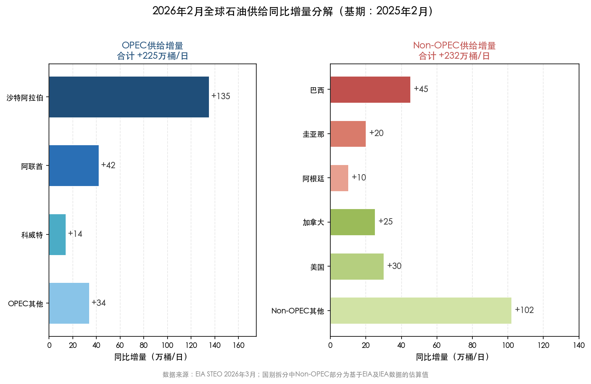

*图注：以2025年2月为基期，左侧面板为OPEC内部增量分解（合计+225万桶/日），右侧面板为Non-OPEC内部增量分解（合计+232万桶/日），Non-OPEC增量首次略超OPEC。数据来源：EIA STEO 2026年3月，Non-OPEC国别拆分基于EIA及IEA数据估算。*

### 3.2.1 OPEC+：从减产到增产的历史性转向

2026年供给过剩的第一大驱动力来自OPEC+。2022年以来，OPEC+通过三层减产安排累计削减产量约580万桶/日：第一层为2022—2023年达成的全组366万桶/日集体减产（延续至2026年底）；第二层为2023年11月八国（沙特、俄罗斯、伊拉克、阿联酋、科威特、哈萨克斯坦、阿尔及利亚、阿曼）自愿额外减产220万桶/日[Rigzone报道](https://www.rigzone.com/news/opec_countries_will_start_unwinding_2mm_bpd_cut_from_april-04-mar-2025-179811-article/ "OPEC+ to start unwinding 2.2 million bpd cut from April 2025")。

转折点出现在2025年4月——八国开始逐步退出220万桶/日的自愿减产。该批减产在2025年4月至9月间被完全退出[EnergyNow报道](https://energynow.com/2025/11/explainer-opec-policies-of-oil-output-hikes-and-cuts/ "OPEC+ fully unwound 2.2 million bpd voluntary cuts by September 2025")。2025年11月，OPEC+进一步决定维持增产势头不变，但在2026年Q1暂停进一步增产以应对市场不确定性[Energy Industry Review](https://energyindustryreview.com/oil-gas/oil-production-growth-for-q1-2026-blocked-by-opec/ "OPEC+ agreed to maintain production levels for Q1 2026")。

EIA数据清晰展示了增产的实际效果。沙特阿拉伯2026年2月原油产量达1,020万桶/日，较2025年2月的885万桶/日增加135万桶/日（+15.25%）。阿联酋从316万桶/日增至358万桶/日（+13.29%），科威特从243万桶/日增至257万桶/日（+5.76%）。OPEC整体原油供给从2025年2月的2,716万桶/日升至2026年2月的2,925万桶/日，同比增209万桶/日（+7.70%）；加上其他液体燃料，OPEC总供给达3,516万桶/日，同比增225万桶/日[OPEC石油供给量及产能概况](assets/data/images/screenshot-20260325-143056.png "EIA 2026年3月STEO OPEC供给数据")。

增产的代价同样清晰：OPEC总剩余产能从2025年2月的502万桶/日降至2026年2月的320万桶/日，降幅36.3%。正如第2章所分析的，剩余产能收窄使得任何供给中断事件的价格放大效应成倍增加——3月伊朗冲突中的极端油价反应正是这一逻辑的实证。

### 3.2.2 Non-OPEC：巴西、圭亚那、阿根廷接棒美国

供给过剩的第二大驱动力来自OPEC体系之外。EIA数据显示，2026年2月Non-OPEC供给达7,272万桶/日，同比增加232万桶/日（+3.29%），增量甚至略超OPEC的225万桶/日[全球石油消费、供给概况表](assets/data/images/screenshot-20260325-143038.png "Non-OPEC供给同比数据")。

IEA 1月月报预测2026年全球供给将增长250万桶/日至108.7百万桶/日，其中Non-OPEC+国家贡献约52%——首次超过OPEC+[IEA 1月月报](https://www.iea.org/reports/oil-market-report-january-2026 "World oil supply projected to rise by 2.5 mb/d in 2026, non-OPEC+ over half")。

Non-OPEC供给增长的结构值得深入拆解。EIA 2025年12月STEO显示，巴西、圭亚那和阿根廷三国合计贡献了约一半的Non-OPEC增长[Oil & Gas 360](https://www.oilandgas360.com/brazil-guyana-and-argentina-drive-non-opec-crude-growth-into-2026-eia-says/ "Brazil, Guyana and Argentina drive non-OPEC crude growth into 2026")：

**巴西：** 2025年原油产量在新FPSO投产推动下首次突破400万桶/日（10月达峰值），EIA预测2026年均产约400万桶/日。Petrobras旗下Buzios油田两座新FPSO将在2026年投产，支撑产量维持高位。

**圭亚那：** 全球增速最快的产油国之一，产量自2020年以来增长近十倍。2025年均产约75万桶/日，ExxonMobil运营的Stabroek区块持续推进开发；Yellowtail项目于2025年末达到满产，推动11月产量突破90万桶/日。2026年Uaru项目投产预计新增25万桶/日产能，有望推动圭亚那2027年突破100万桶/日。

**阿根廷：** Vaca Muerta页岩油田——美国以外少数具备规模化生产能力的非常规油气资源——是增长核心引擎。2025年全国原油产量约74万桶/日，预计2026年增至约81万桶/日，Vaca Muerta贡献全国产量的60%以上。

### 3.2.3 美国：高位平台期，增长动能趋弱

作为全球最大产油国，美国的供给走势具有特殊的风向标意义。EIA 2025年12月STEO预测美国2026年原油产量均值约1,350万桶/日，较2025年记录高位略降约10万桶/日[EIA分析](https://www.eia.gov/todayinenergy/detail.php?id=66844 "EIA forecasts U.S. crude oil production will decrease slightly in 2026")，将是连续四年产量增长后的首次温和回调。

增长放缓的原因来自多个层面。**其一，**二叠纪盆地（Permian Basin）仍是美国增产的绝对主力——2025年该盆地致密油产量达600万桶/日，占全美原油产量的44%[EIA Permian数据](https://www.eia.gov/todayinenergy/detail.php?id=67364 "EIA refines estimates for Permian tight oil production")。但Jefferies预测2026年二叠纪盆地增量仅约6.6万桶/日，几乎等于全美页岩增量的全部[Yahoo Finance](https://uk.finance.yahoo.com/news/strong-u-shale-2026-093011231.html "Jefferies forecasts 66,000 bpd of Permian growth in 2026")——美国页岩油的边际增长已接近"天花板"。**其二，**阿拉斯加和墨西哥湾的温和增产将被其他地区产量自然衰减所抵消。**其三，**从更长周期看，EIA年度能源展望预测美国页岩油产量将在2027年达到约1,000万桶/日的峰值，此后进入下降通道[ANRPC报道](https://www.anrpc.org/news/us-oil-production-to-peak-by-2027-as-shale-boom-fades%252C-eia-forecasts "US shale oil production to peak at 10 million bpd in 2027")。

美国产量增长趋缓并不意味着全球Non-OPEC供给减速——巴西、圭亚那、阿根廷和加拿大正接过增量接力棒。但这确实意味着全球供给增长的引擎正从单一的"美国页岩故事"转向更分散的多极格局。

## 3.3 需求端：Non-OECD支撑增长，但增速不及供给

### 3.3.1 全球需求增长的结构分化

供需失衡的另一面在于需求增速相对疲弱。EIA数据显示，2026年2月全球石油消费10,514万桶/日，同比增长201万桶/日（+1.95%）。增长的结构性特征十分鲜明：Non-OECD经济体消费5,870万桶/日，同比增129万桶/日，贡献全球增量的64%；OECD经济体消费4,644万桶/日，同比增72万桶/日[全球石油消费概况](assets/data/images/screenshot-20260325-143048.png "EIA 2026年3月STEO全球石油消费")。

分国家和地区看：

- **美国：** 2,059万桶/日（同比+37万桶/日，+1.82%），增长主要来自炼厂加工量回升和出行需求温和恢复。
- **中国：** 1,697万桶/日（同比+32万桶/日，+1.90%），增速约2%，与此前5—8%的年增长率相比已大幅放缓。S&P Global预计中国2026年石油需求增长仅约1%[S&P Global](https://www.spglobal.com/ratings/en/regulatory/article/2026-outlook-china-commodities-watch-upstream-stays-firm-br--s101655273 "China oil demand to edge up just 1% in 2026")，电动车渗透率快速提升和经济结构向服务业转型正在侵蚀边际石油需求。
- **印度：** 604万桶/日（同比+31万桶/日，+5.35%），增速远超中国。OPEC世界石油展望将印度列为未来全球石油需求增长的最大贡献者[OPEC WOO](https://www.pib.gov.in/PressReleasePage.aspx?PRID=2219796&reg=3&lang=2 "India projected as largest contributor to global oil demand growth till 2050")。
- **欧洲：** 1,338万桶/日（同比+14万桶/日，+1.03%），增长乏力，能效改善和电气化持续压制石油消费。

### 3.3.2 机构间的需求增长分歧

三大机构在需求增长预测上存在显著分歧。IEA 2月月报预测2026年全球需求增长85万桶/日，3月因高油价和经济前景恶化进一步下修至64万桶/日[Reuters 3月报道](https://www.reuters.com/business/energy/world-faces-largest-ever-oil-supply-disruption-middle-east-war-iea-says-2026-03-12/ "IEA cuts 2026 demand growth to 640,000 bpd")。OPEC预测则乐观得多，给出约140万桶/日的增长估计[OPEC月报](https://www.facebook.com/OPECSecretariat/posts/in-2026-global-oil-demand-is-forecast-to-grow-by-about-14-mbd-y-o-y-unchanged-fr/1151723297107368/ "OPEC forecasts 1.4 mb/d global oil demand growth in 2026")。EIA STEO全年数据隐含的需求增长约123万桶/日（从2025年103.94升至2026年105.17百万桶/日），居于IEA和OPEC之间。

需求增长预测的分歧直接决定供过于求的规模判断。OPEC数据暗示——在OPEC+维持当前产量的情况下——2026年市场可能接近平衡；而IEA口径则指向近250万桶/日的巨大过剩。我们倾向于认为IEA和EIA的判断更为审慎合理：高油价对需求的抑制效应已开始显现（IEA 3月月报将需求增长下调21万桶/日即为明证），而OPEC的预测历史上存在系统性偏高的倾向。

### 3.3.3 中国"天花板"与印度"接力棒"

全球石油需求增长格局正经历一次深层结构性迁移。中国——过去二十年全球石油需求增长的最大引擎——正接近增长天花板。电动车渗透率在2025年已超过新车销量的50%，高铁网络持续替代公路运输需求，经济增长模式从投资驱动转向消费和服务业驱动，上述结构性因素共同压制边际石油需求。S&P Global给出的"仅1%增长"判断并非悲观假设，而是对上述趋势的合理外推。

印度正接过增长接力棒。年均5%以上的石油消费增速、快速的城镇化进程、尚处早期阶段的汽车保有量扩张，使印度的需求增长故事更接近中国十年前的轨迹。但印度体量（604万桶/日）仅为中国（1,697万桶/日）的约三分之一，即便增速更高，短期内绝对增量仍难以完全替代中国的角色。

这种"接力棒"传递意味着：全球石油需求增长不会断崖下跌，但增速重心正从体量最大、基础设施最完善的中国转向增速更高但政策环境更具不确定性的印度和东南亚。对供需平衡表而言，需求端出现"超预期增长"的概率在降低，而供给端的增量确定性更高。

## 3.4 库存通道：从累积到溢出的压力传导

### 3.4.1 OECD商业库存的持续攀升

供给剩余最终体现为库存累积。EIA季度预测显示，OECD商业库存将从2026年Q1的28.33亿桶逐步升至Q4的29.37亿桶，全年净增约1.04亿桶[EIA季度预测](assets/data/images/screenshot-20260325-143106.png "OECD商业库存季度预测")。

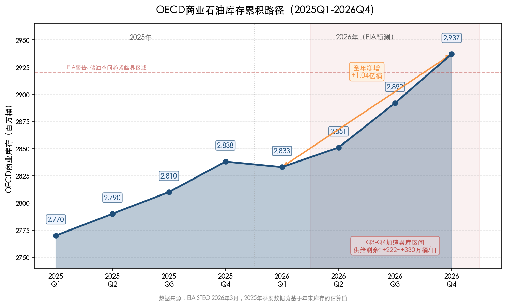

*图注：横轴覆盖2025Q1至2026Q4，纵轴为OECD商业库存（百万桶）。2026年全年净增1.04亿桶，Q3—Q4进入加速累库区间，供给剩余达222—330万桶/日。红色虚线标注EIA警告的储油空间趋紧临界区域。数据来源：EIA STEO 2026年3月。*

月度数据进一步印证这一趋势：2026年2月OECD商业库存已达28.62亿桶，同比增加1.36亿桶（+4.97%）。这一累积速度在过去五年中仅次于2020年疫情冲击期间的被动累库。

### 3.4.2 中国战略储备的"隐性需求"效应

库存图景中还有一个容易被忽视的变量：中国的战略石油储备建设。EIA 2月分析特别指出，2025年Non-OECD库存增加约230万桶/日，其中约一半可归因于中国战略储备填充和受制裁油品浮式储存增加[EIA 2月分析](https://www.eia.gov/todayinenergy/detail.php?id=67164 "Half of non-OECD inventory builds attributable to China SPR and floating storage")。EIA预计中国2026年将继续以约100万桶/日的速度填充战略储备，与2025年速率相当。

中国的战略储备购买实质上构成一种"隐性需求"——它吸收了全球过剩产出的相当部分，使基准原油价格（尤其是布伦特）并未像过剩规模所暗示的那样大幅下跌。但这一"缓冲"存在天花板：随着中国战略储备设施逐步填满，该部分隐性需求终将消退，届时过剩压力将更加直接地传导至价格。

### 3.4.3 累库路径对价格的含义

历史经验表明，持续库存累积会以两种方式压制油价：**其一，**现货市场出现contango（远期升水）结构，即远月合约价格高于近月合约，鼓励储存而非消费，进一步压低现货价格；**其二，**当可用储油空间趋紧时，边际存储成本上升迫使生产商降价出售，形成价格下行的加速通道。

EIA在2月分析中明确警告这一机制正在形成："随着OECD商业储油设施逐渐填满，更高的边际存储成本应当促使市场参与者寻求其他更昂贵的储油方案，这将导致更低的原油价格和更慢的全球石油产量增长。"这一判断在EIA 2月STEO中体现为布伦特2026年均价仅58美元/桶、2027年进一步降至53美元/桶的预测——尽管3月战争冲击暂时打断了该路径。

## 3.5 短期冲击与中期基本面的矛盾：如何理解"过剩中的紧缺"

本章数据指向一个看似矛盾的现实：基本面显示全年供过于求，但现货价格在3月一度飙升至120美元。理解这一矛盾需要从三个维度切入。

**第一，战争冲击改变了"有效供给"而非"产能供给"。** EIA平衡表中的供给数据反映的是产能水平和计划产量，而3月伊朗冲突的核心影响在于霍尔木兹海峡通行受阻——大量已生产的石油无法运抵消费市场。IEA 3月报告指出，中东海湾国家因冲突削减了至少1,000万桶/日的产量，全球3月有效供给下降约800万桶/日[Reuters 3月报道](https://www.reuters.com/business/energy/world-faces-largest-ever-oil-supply-disruption-middle-east-war-iea-says-2026-03-12/ "Middle East Gulf countries cut production by at least 10 million bpd")。但IEA同时强调，4月起随着沙特和阿联酋利用替代出口路线绕过海峡，部分产量有望恢复。全年看，供给增速仍将超过需求增速。

**第二，过剩是"平均态"，紧缺是"脉冲态"。** 全年+187万桶/日的过剩是四个季度的均值，而3月的紧缺是单月的极端偏离。历史上这种"平均过剩+脉冲紧缺"的组合并不罕见——2022年俄乌冲突期间，全年供需基本平衡但Q2价格飙升至130美元以上即为前例。脉冲消退后，价格终将向基本面回归。

**第三，战略储备释放和OPEC剩余产能是弥合缺口的阀门。** IEA成员国释放的4亿桶战略储备，按60天计算约相当于667万桶/日的额外供给流，与800万桶/日的缺口相比仍有差距，但已大幅缓解市场恐慌。一旦霍尔木兹海峡通行恢复，这些储备释放量将直接转化为额外的库存累积，加速市场向过剩均衡回归。

综合判断，3月极端行情终将消退，供需基本面预计在Q3-Q4重新主导定价。Q3供给剩余222万桶/日、Q4供给剩余330万桶/日的路径斜率表明，即便地缘溢价缓慢消退，下半年的过剩压力也足以驱动油价重心系统性下移。这一基本面约束将在第4章的趋势研判中得到进一步量化。

# 第4章 后续趋势研判——反弹天花板与中枢下移

第3章系统呈现了2026年全年供过于求的基本面全景：EIA口径+187万桶/日、IEA口径+246万桶/日的过剩规模，以及Q3-Q4加速累库的路径斜率，为本章趋势研判提供了最核心的定价锚。3月地缘冲击将布伦特从72美元推升至盘中120美元，市场面临的核心问题已从"能否反弹"切换至"反弹的天花板在哪里，中枢将向何处回归"。本章综合主要机构的预测分歧、供需推演的量化路径、终端消费传导机制以及上行与下行风险的不对称分布，给出2026年Q2-Q4及2027年油价趋势的研判框架。

## 4.1 机构预测的巨大分歧——同一个市场，两种叙事

### 4.1.1 五家机构的价格路径对比

截至2026年3月下旬，全球主要机构对布伦特2026年全年均价的预测分布极为分散，折射出市场对"地缘冲击持续性"与"基本面回归速度"两大变量的根本性分歧：

| 机构 | Brent 2026E（美元/桶） | WTI 2026E（美元/桶） | Brent 2027E（美元/桶） | 核心假设 |
|------|----------------------|---------------------|----------------------|---------|
| EIA（3月STEO） | 79 | 74 | 64 | 冲击-消退路径：Q2仍受地缘溢价支撑，下半年回归基本面 |
| S&P Global Ratings（3月修订） | 80 | 75 | 65 | 霍尔木兹关闭至3月底/4月初，此后油流渐进恢复 |
| Goldman Sachs（3月23日） | 85 | 79 | 80 | 史上最大供给冲击，Hormuz恢复缓慢，上行风险显著 |
| J.P. Morgan | ~60 | ~55 | 低至30s | 供过于求压倒一切，2027年极端过剩 |
| Thomson Reuters（2月底） | 63.85 | 60.38 | 65.06 | 纯基本面定价，未纳入3月伊朗冲突 |

数据来源：[EIA STEO](https://www.eia.gov/outlooks/steo/ "EIA Short-Term Energy Outlook, March 2026")、[S&P Global Ratings](https://www.spglobal.com/ratings/en/regulatory/article/sp-global-ratings-raises-2026-oil-price-assumptions-on-longerthanexpected-oil-flows-disruption-s101675235 "S&P raises 2026 oil price assumptions by $15/bbl")、[Goldman Sachs](https://www.reuters.com/business/energy/goldman-sachs-raises-2026-brent-crude-average-price-forecast-by-8-85-barrel-2026-03-23/ "Goldman raises Brent 2026 to $85")、[J.P. Morgan](https://oilprice.com/Energy/Oil-Prices/JP-Morgan-Says-Oil-Prices-Could-Plunge-Into-30s-by-2027.html "JP Morgan sees Brent in $30s by 2027")、[Thomson Reuters](https://www.reuters.com/business/energy/analysts-hike-oil-outlook-geopolitical-risks-oversupply-concerns-limit-upside-2026-02-27/ "Thomson Reuters Brent $63.85 for 2026")

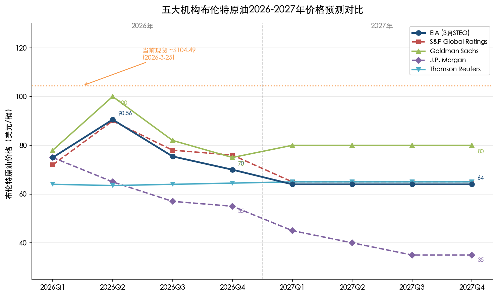

上图以季度为横轴展示五家机构的布伦特预测路径，并标注当前现货价位（约104.49美元）作为参照锚。最高预测（Goldman Sachs 85美元）与最低预测（J.P. Morgan约60美元）之间的差距达25美元/桶，相当于当前均价的约30%——这种分散度在正常市场环境下极为罕见。分歧的根源并非各家对基本面数据的认知差异（供过于求的判断高度一致），而在于对三个关键假设的不同定量：**地缘溢价的持续时间、霍尔木兹海峡恢复通行的速度，以及OPEC剩余产能的实际可用性。**

### 4.1.2 分歧根源一：地缘溢价的半衰期

EIA与S&P Global代表"有序消退"假设。EIA的季度路径为Brent Q1均价约75美元、Q2升至90.56美元（含3月冲击），Q3降至75.45美元、Q4回落至70美元，全年均价79美元，2027年进一步降至64美元[EIA STEO](https://www.eia.gov/outlooks/steo/ "Brent above $95 next two months, below $80 by Q3, $70 by year-end")。该路径隐含的核心假设是：霍尔木兹海峡于4月恢复基本通行，地缘溢价在Q3大幅收敛，Q4由基本面重新主导定价。S&P Global于3月中旬将2026年剩余月份的Brent假设上调15美元至80美元，但维持2027年65美元不变，同样暗示冲击在年内消退[S&P Global Ratings](https://www.spglobal.com/ratings/en/regulatory/article/sp-global-ratings-raises-2026-oil-price-assumptions-on-longerthanexpected-oil-flows-disruption-s101675235 "Disruption persists until late March or early April, then gradual recovery")。

Goldman Sachs持更为审慎的立场。其3月23日报告将Brent 2026均价从77美元上调至85美元，但更关键的信号在于：Goldman预测Brent和WTI在2027年分别维持80美元和75美元——远高于EIA和S&P 2027年的64-65美元[Goldman Sachs](https://www.reuters.com/business/energy/goldman-sachs-raises-2026-brent-crude-average-price-forecast-by-8-85-barrel-2026-03-23/ "Brent/WTI stable at $80/$75 through 2027")。Goldman明确指出"过去大型供给冲击的持续性表明油价可能长期维持在100美元以上"，并警告若Hormuz中断风险持续，Brent甚至可能超越2008年的历史峰值[Goldman Sachs](https://www.reuters.com/business/energy/goldman-sachs-flags-upside-risks-oil-prices-near-term-into-2027-2026-03-19/ "Brent could surpass 2008 peak if disruption risks persist")。其基准假设为油流自4月渐进恢复、布伦特Q4回落至70美元区间，但上行情景的概率权重显著高于下行情景。

Thomson Reuters与J.P. Morgan代表"基本面压倒一切"的另一极。Thomson Reuters 2月底的预测完全锚定供过于求，未纳入任何地缘溢价——布伦特各季度均价在63.5-64.5美元区间窄幅波动，全年63.85美元[Thomson Reuters](https://www.reuters.com/business/energy/analysts-hike-oil-outlook-geopolitical-risks-oversupply-concerns-limit-upside-2026-02-27/ "Brent $63.85 for 2026, before Iran conflict")。J.P. Morgan更为激进：2025年11月即预测布伦特可能在2027年跌至30美元区间，理由是OPEC+与美洲Non-OPEC的双重增产将造成200万桶/日的累积过剩[J.P. Morgan](https://oilprice.com/Energy/Oil-Prices/JP-Morgan-Says-Oil-Prices-Could-Plunge-Into-30s-by-2027.html "Brent could drop into $30s by 2027 due to oversupply")。尽管J.P. Morgan在3月冲突后亦认可油价短期可能冲击120美元，但其中期逻辑并未改变——战争溢价终将消退，基本面过剩的引力难以抗拒。

### 4.1.3 分歧根源二：OPEC增产节奏与剩余产能约束

各机构对OPEC+增产路径的预判同样构成重要分歧维度。EIA的预测隐含OPEC于冲突结束后继续执行增产计划，意味着供给压力将在下半年加速释放。S&P Global在报告中特别指出，即便沙特通过东-西管线（名义产能500万桶/日、可扩至700万桶/日）和阿联酋Fujairah终端（产能180万桶/日）绕过霍尔木兹海峡，也仅能替代正常Hormuz流量的一小部分[S&P Global Ratings](https://www.spglobal.com/ratings/en/regulatory/article/sp-global-ratings-raises-2026-oil-price-assumptions-on-longerthanexpected-oil-flows-disruption-s101675235 "Saudi East-West Pipeline and UAE Fujairah replace only a small share of normal Hormuz volumes")。更为关键的是，OPEC剩余产能已从2025年2月的502万桶/日降至2026年2月的320万桶/日，有效部分可能仅为账面数字的60%左右——即便冲突结束，OPEC的增产空间亦已大幅压缩，难以像2011年利比亚危机时那样迅速补充供给缺口。

Goldman Sachs明确将此视为上行风险的核心来源："供给可能持续受限更长时间，尤其如果产能受损"，但亦指出"一旦油流恢复，OPEC部署剩余产能可能导致产出上升"[Goldman Sachs](https://www.reuters.com/business/energy/goldman-sachs-flags-upside-risks-oil-prices-near-term-into-2027-2026-03-19/ "Supply could remain constrained longer if capacity damaged")。这种"薄缓冲+高不确定性"的组合，正是当前预测分散度异常偏高的深层原因。

## 4.2 核心判断：Q2见顶、下半年回落、2027年中枢下移

综合以上机构预测与前三章分析框架，我们提出四项核心判断：

**判断一：Q2为本轮反弹天花板所在。** 二季度具备地缘溢价与季节性需求的双重支撑——EIA预测Q2供给剩余仅72万桶/日，为全年最紧窗口。叠加霍尔木兹海峡通行尚未完全恢复的不确定性，布伦特Q2均价预计落在85-95美元区间，天花板约在100美元附近。我们判断3月盘中触及的119.50美元已是本轮周期的极端高点，除非出现沙特基础设施遭袭等进一步升级情景，否则该价位难以被突破。

**判断二：Q3-Q4供需基本面重新主导定价，布伦特回落至70-80美元区间。** 第3章数据已清晰显示：Q3供给剩余从Q2的72万桶/日陡升至222万桶/日，Q4进一步扩大至330万桶/日；OECD商业库存从Q1的28.33亿桶持续累积至Q4的29.37亿桶，全年净增约1亿桶。这种量级的过剩压力将通过期货曲线contango结构加深、边际存储成本上升和生产商被迫降价三重渠道传导至现货价格。EIA预测Brent Q3均价75美元、Q4均价70美元，我们认为该路径基本合理，但提示两个修正方向：若地缘溢价消退快于预期（如4月即达成停火），Q3可能降至70美元区间下沿；若冲突拖延至夏季，Q3则可能维持在80美元附近。

**判断三：2027年布伦特中枢下移至60-70美元区间。** EIA预测2027年均价64美元，S&P Global给出65美元，两者高度一致。核心支撑逻辑包括三方面：（1）OPEC+增产路径在2026年消化一轮后，2027年供给压力边际减轻但仍处历史高位；（2）全球库存在2026年大幅累积后，2027年去库压力将压制价格反弹空间；（3）EIA预测美国页岩油产量在2027年达到约1,000万桶/日的阶段性峰值，2026年高油价刺激的产量增长将在2027年完全兑现——EIA已将2027年美国原油产量预测从上月的1,330万桶/日上调至1,380万桶/日[EIA STEO](https://www.eia.gov/outlooks/steo/ "US crude production 13.8 million bpd in 2027, up 0.5 million from last month")。Goldman Sachs给出的80美元2027年预测属明显的outlier，其隐含假设为地缘风险溢价长期化——我们认为该假设概率偏低，历史上大型供给冲击后油价通常在6-12个月内回归基本面水平。

**判断四：J.P. Morgan的"30美元情景"属低概率尾部风险，而非基准路径。** J.P. Morgan 2025年11月给出的"2027年布伦特跌至30美元区间"预测，隐含OPEC+价格战与全球需求深度衰退的双重假设。我们判断，沙特在财政盈亏平衡油价约80美元/桶的约束下，主动发动价格战的概率极低；全球经济虽面临高利率和地缘不确定性的拖累，但尚未出现衰退级别的需求坍塌信号。Goldman Sachs亦指出"2026年将是最后一轮大型供给浪潮冲击市场的年份"，2027年市场有望开始再平衡[Goldman Sachs](https://oilprice.com/Energy/Oil-Prices/JP-Morgan-Says-Oil-Prices-Could-Plunge-Into-30s-by-2027.html "2026 will be the last big oil supply wave")。因此，布伦特跌破50美元的深度下行情景，我们赋予不超过10%的概率权重。

## 4.3 终端消费传导：从原油到泵价的价格漏斗

油价变动最终通过汽油和柴油价格传导至终端消费者与实体经济。厘清这一传导机制，是评估油价变动宏观影响的关键环节。

### 4.3.1 美国汽油价格分解：原油占比结构性下降

EIA 3月STEO将2026年美国零售汽油均价预测上调至3.34美元/加仑（此前为2.91美元），柴油均价上调至4.12美元/加仑（此前为3.43美元）[EIA STEO](https://www.eia.gov/outlooks/steo/ "Retail gasoline $3.34/gal, diesel $4.12/gal in 2026")。上调幅度分别达14.7%和20.1%，完全由3月原油价格飙升驱动。

从结构拆分看，一加仑汽油零售价可分解为四个组成部分：原油成本、炼油利润（裂解价差）、流通与营销费用、联邦及州税费。EIA数据显示，冲突前的低油价环境中（2025年11月），原油成本约占汽油零售价的50%[纽约时报](https://www.nytimes.com/2026/03/10/business/gasoline-price-energy-costs.html "Crude oil accounted for about 50% of gasoline price in November")。值得关注的是，一个结构性变化正在发生：EIA预测2026年原油成本在汽油价格中的占比将降至约44%（2025年为53%），而炼厂裂解价差及其他成本占比上升[EIA分析](https://www.eia.gov/todayinenergy/detail.php?id=67024 "Crude oil contribution to gasoline price falls below 45% in 2026-2027")。

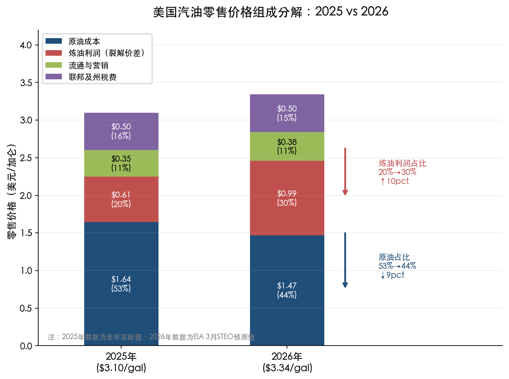

上图对比了2025年（3.10美元/加仑）与2026年（3.34美元/加仑）汽油零售价的四层分解结构，原油成本占比从53%降至44%（下降9个百分点），炼油利润占比从20%升至30%（上升10个百分点）。

这一结构变化的核心含义在于：**当原油价格下跌时，消费者在加油站感受到的降价幅度将小于原油跌幅。** 炼厂裂解价差从2024年均值约0.52美元/加仑扩大至2026年预计的0.84美元/加仑（柴油口径），涨幅超过60%[MMCG分析](https://www.mmcginvest.com/post/u-s-fuel-prices-change-forecast-2026-impact-on-gas-stations-margins-and-profitability "Diesel crack spread jumps from $0.52 in 2024 to $0.84 in 2026")。裂解价差走阔的驱动因素包括：Phillips 66 Wilmington炼厂（13.9万桶/日）2025年底关闭、Valero Benicia炼厂（17万桶/日）2026年4月关停，美国西海岸炼油产能合计缩减约8-10%，供给收紧直接推高了炼油环节的利润率。

### 4.3.2 传导的非线性与"火箭-羽毛"效应

原油价格向零售汽油的传导具有典型的非线性特征，业界常称之为"火箭-羽毛效应"（Rockets and Feathers）：油价上涨时加油站调价迅速（如火箭升空），油价下跌时调价缓慢（如羽毛飘落）。2026年3月的冲击正在实时演绎这一规律——截至3月8日（冲突爆发第一周），原油价格较年初上涨约50%，美国全国汽油均价已飙升至约4.09美元/加仑[EIA STEO](https://www.eia.gov/outlooks/steo/ "Brent up about 50% from beginning of year as of March 9")。然而EIA全年预测显示，即便布伦特下半年如期回落至70-80美元区间，全年汽油均价仍为3.34美元/加仑——比2025年的3.10美元/加仑高出近8%。消费者将在整个2026年承受高于2025年的泵价：原油年均价从69美元升至79美元（+14.5%），汽油零售价涨幅（+7.7%）虽经"漏斗"稀释，但仍实质性传导至居民消费支出。

### 4.3.3 传导的宏观含义

原油到泵价的传导链条最终作用于两个关键宏观变量：**通胀预期与消费者信心。** 第2章已分析，FOMC 3月会议将2026年PCE通胀预测从2.4%上调至2.7%，直接反映了能源成本传导的预期。EIA数据显示，2026年零售柴油均价4.12美元/加仑较2025年的3.70美元高出11.4%——柴油作为物流运输的核心成本，其涨价将通过供应链逐步传导至食品、消费品和工业品的终端售价。

从消费者端观察，汽油支出在美国家庭可支配收入中的占比通常在3-5%之间波动。当油价从70美元飙升至100美元以上时，这一比例可能短暂接近5-6%——绝对水平虽仍低于2008年和2022年的峰值，但足以对边际消费倾向产生抑制作用。EIA预测2027年汽油均价回落至3.18美元/加仑、柴油回落至3.78美元/加仑，意味着能源成本对通胀的推升效应将在2027年逐步缓解。

## 4.4 情景分析：上行与下行风险的不对称分布

基准路径（Q2天花板90美元附近、Q4回落至70美元、2027年均价64美元）面临分布不对称的风险敞口。

### 4.4.1 上行风险：三个尾部情景

**情景一：霍尔木兹海峡持续关闭超过6个月。** Fitch Ratings 3月20日分析明确警告：若海峡关闭持续6个月，布伦特年均价可能达120美元/桶，危机期间峰值或触及130-170美元[Fitch Ratings](https://www.fitchratings.com/research/corporate-finance/oil-prices-could-average-usd120-bbl-if-hormuz-closed-for-six-months-20-03-2026 "Brent $120 average, peak $130-170 under 6-month closure")。S&P Global估计3月1日至11日间全球市场已累计损失约1,700万桶/日的原油和成品油供给（其中约1,200万桶/日为原油），即便沙特东-西管线和阿联酋Fujairah全力运转也仅能替代很小一部分[S&P Global Ratings](https://www.spglobal.com/ratings/en/regulatory/article/sp-global-ratings-raises-2026-oil-price-assumptions-on-longerthanexpected-oil-flows-disruption-s101675235 "Global markets lost approximately 17 million bpd between March 1-11")。我们赋予该情景约15%的概率。

**情景二：伊朗基础设施遭受结构性损毁。** S&P Global特别提及伊朗Kharg岛（承载伊朗90%以上石油出口）基础设施"据报仍完好"，但若后续遭到打击，伊朗每日约130万桶出口将面临长期中断，同时可能引发伊朗对沙特和阿联酋石油设施的报复性攻击[S&P Global Ratings](https://www.spglobal.com/ratings/en/regulatory/article/sp-global-ratings-raises-2026-oil-price-assumptions-on-longerthanexpected-oil-flows-disruption-s101675235 "Iran's Kharg Island reportedly remains intact")。Goldman Sachs将此定性为油价可能"超越2008年峰值"的触发条件[Goldman Sachs](https://www.reuters.com/business/energy/goldman-sachs-flags-upside-risks-oil-prices-near-term-into-2027-2026-03-19/ "Could surpass 2008 peak if disruption persists")。我们赋予约5%的概率。

**情景三：全球经济韧性超预期，需求上修。** 若OPEC预测的140万桶/日需求增长最终得到验证（远高于IEA的64万桶/日），供需缺口将大幅收窄甚至逆转，油价中枢可能维持在85-90美元。我们赋予约10%的概率。

### 4.4.2 下行风险：两个加速通道

**情景一：快速停火叠加OPEC价格纪律崩溃。** 若3月28日谈判取得实质性突破、霍尔木兹海峡于4月初全面恢复通行，地缘溢价将在数周内蒸发。叠加OPEC+内部（尤其是哈萨克斯坦、伊拉克等长期超产国）配额纪律进一步松动，布伦特可能在Q3快速下探至60-65美元区间，接近Thomson Reuters冲突前预测水平。我们赋予约20%的概率。

**情景二：全球衰退引发需求坍塌。** EIA预测美国2026年GDP增速为2.6%，若高油价与高利率的双重挤压导致增速骤降至1%以下，叠加欧洲和中国经济进一步走弱，全球石油需求可能出现负增长——幅度或类似2020年但更为温和。在此情景下，布伦特可能跌破60美元甚至接近50美元。我们赋予约10%的概率。

### 4.4.3 概率加权的价格区间

综合以上情景分析，我们给出2026年Q2至2027年的概率加权价格区间：

| 时间窗口 | 基准路径（40%概率） | 上行情景（30%概率） | 下行情景（30%概率） | 概率加权中枢 |
|---------|-------------------|-------------------|-------------------|------------|
| 2026 Q2 | 85-95 | 100-120 | 75-85 | ~90 |
| 2026 Q4 | 68-75 | 85-100 | 55-65 | ~73 |
| 2027全年 | 60-68 | 75-85 | 45-55 | ~65 |

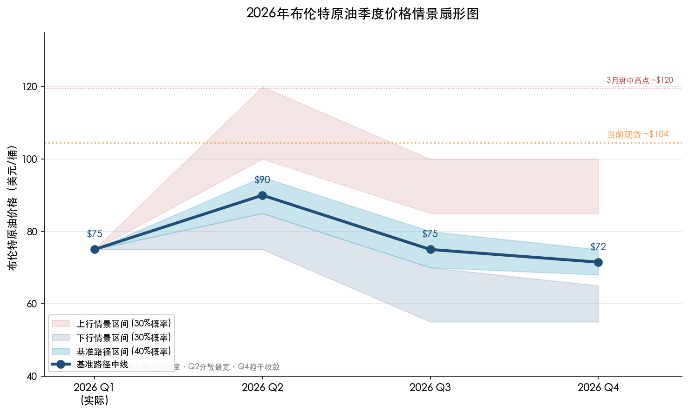

上图以基准路径为中线，上下分别展示上行与下行情景的概率区间带。Q2不确定性最大（区间宽达45美元），Q4趋于收敛，反映地缘溢价随时间递减、基本面引力逐步增强的趋势。

上述数据表明：**短期（Q2）油价仍有较强的上行惯性，但中期（Q4-2027年）的大方向是向60-70美元中枢回归。** 上行风险与下行风险的分布虽大致对称，但存在一个关键的非对称性——上行情景多为事件驱动（地缘升级、设施损毁），触发是离散且难以预测的；下行情景更多依赖基本面的累积效应（库存持续上升、需求增速持续走弱），实现过程是渐进且可追踪的。这种特征意味着：**中期投资策略应以基本面下行为锚，同时对地缘尾部风险保持对冲。**

## 4.5 合理价格中枢的锚定：OPEC财政盈亏平衡与边际成本

在市场给出的多种价格路径中，两个"硬约束"为合理中枢提供了上下边界：

**上边界：OPEC核心国财政盈亏平衡油价。** 沙特财政盈亏平衡油价约80-85美元/桶（IMF口径），当油价持续低于该水平时，沙特将面临财政赤字压力，增产意愿可能受到抑制，由此形成价格的"政策地板"。但2014-2016年和2020年的经验表明，沙特在极端情况下可容忍油价大幅低于盈亏平衡线长达12-18个月，这一"地板"属软性而非刚性约束。

**下边界：全球边际生产成本。** 美国页岩油全周期盈亏平衡成本在45-55美元/桶区间（二叠纪盆地核心区约40-45美元，外围区域50-60美元）。当布伦特跌至60美元以下时，美国页岩油活跃钻机数将明显下降，供给增长自发收缩，形成价格的自我修复机制。EIA预测2027年美国产量高达1,380万桶/日，但该预测建立在2026年高油价刺激之上——若2027年油价跌至60美元以下，实际产量可能低于预测约20-30万桶/日。

两个约束条件共同框定的"合理中枢"区间为**60-80美元/桶**。在此区间内，OPEC的增减产决策与美国页岩油的供给弹性将构成价格的自动稳定器。当前104美元的价格位置显然远超该区间上沿，印证了第1章的判断——当前价格水平内嵌约25-32美元的战争溢价，这部分溢价随地缘紧张缓解将逐步压缩。

## 4.6 小结：从"战时高位"向"基本面锚"的回归之路

本章分析框架的核心结论可凝练为三点：

**第一，反弹有天花板。** Q2是全年最紧窗口，但即便在最乐观的地缘情景下，119.50美元的盘中极端高点已是本轮周期的顶部。Q2均价预计在85-95美元区间，持续超过100美元的时间窗口有限。

**第二，中枢在下移。** Q3-Q4供给剩余从72万桶/日飙升至330万桶/日，库存持续累积将驱动布伦特重心回落至70-80美元区间。2027年随着地缘溢价完全消退、全球供给进一步扩张，中枢有望降至60-70美元。

**第三，两类风险需区别对待。** 上行风险属事件驱动型（Hormuz长期关闭、设施损毁），适合以期权工具对冲；下行风险属累积型（过剩扩大、需求走弱），更适合通过仓位管理与策略择时应对。3月的极端行情不宜被线性外推——基本面的引力终将主导价格回归，当前正是这种回归开始酝酿的临界时刻。

上述判断框架将在第5章转化为具体的国内外投资策略建议。

# 第5章 投资策略——国内外配置建议

第4章的核心结论为本章提供了清晰的策略锚：Q2是全年供需最紧窗口，布伦特均价预计落在85-95美元区间；Q3-Q4基本面将重新主导定价，价格重心向70-80美元回落；2027年中枢进一步下移至60-70美元。上行风险属事件驱动型（霍尔木兹海峡长期关闭、产能设施损毁），适合以期权工具对冲；下行风险属累积型（过剩扩大、终端需求走弱），更宜通过仓位管理和策略择时加以应对。基于上述判断框架，本章从海外和国内两个维度，围绕期货曲线策略、权益配置、ETF工具选择和风险管理四个层面，给出可操作的投资建议。

## 5.1 海外市场：期货曲线策略与权益配置

### 5.1.1 期货曲线结构：陡峭的Backwardation蕴含套利机会

截至2026年3月中旬，WTI和Brent期货曲线呈现极端的backwardation结构。NYMEX WTI 4月合约报96.19美元/桶，而2027年12月合约仅69.65美元/桶，近远月价差高达约26美元；ICE Brent 5月合约报103.55美元/桶，2027年12月合约74.72美元/桶，价差接近29美元[Commodity Board](https://commodity-board.com/crude-oil-in-backwardation-tight-near-term-softer-long-term-outlook/ "WTI and Brent steep backwardation structure, March 2026")。这种"近月天价、远月回归"的曲线形态，是市场对"短期供给中断+中期供过于求"双重预期的直接映射。

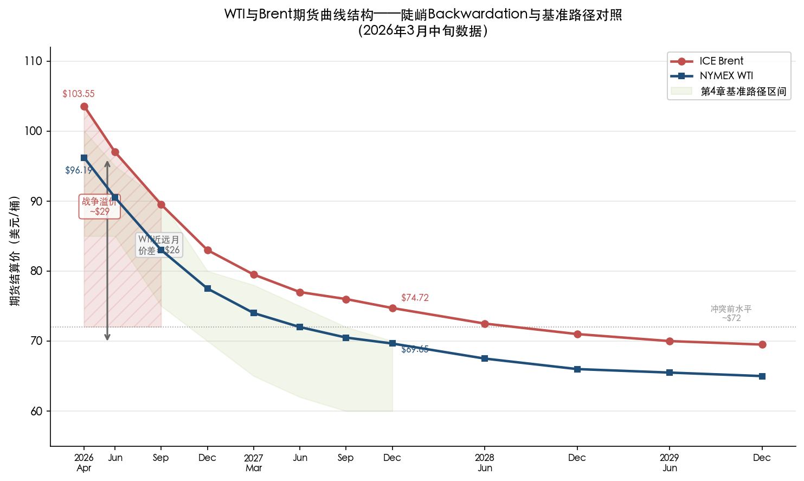

上图清晰展示了WTI与Brent从近月到2029年12月的期货结算价曲线。近月合约内嵌约29美元的战争溢价，而远月价格已回归至冲突前约72美元的基本面水平，与第4章基准路径区间（浅绿色阴影）高度吻合。

陡峭的backwardation结构为三类策略创造了有利条件：

**第一，做空近远月价差（卖近买远的日历价差策略）。** 当前近远月价差处于极端水平，一旦地缘紧张局势缓和、霍尔木兹海峡恢复正常通行，近月合约内嵌的战争溢价将快速蒸发，而远月合约因已锚定基本面中枢（65-75美元）而相对稳定，价差收窄即可兑现盈利。第4章概率分析显示，快速停火情景的概率约20%，若在Q2兑现，WTI近远月价差有望从当前约26美元收窄至10-15美元。然而，冲突升级情景下价差进一步走阔的尾部风险亦不容忽视。

**第二，利用backwardation的展期收益做多远月合约。** 在backwardation结构下，持有远月多头头寸并随时间推移逐步展期至近月，可赚取正的展期收益（roll yield）。2027年12月WTI合约报约70美元，接近第4章判断的2027年合理中枢（60-70美元区间上沿）。若投资者认同该中枢判断，以70美元附近买入远月合约兼具有限的下行空间和可观的展期收益。

**第三，利用put期权对冲近月多头的尾部下行风险。** 对于已持有近月原油多头的投资者，当前期权隐含波动率虽处于高位，但买入虚值put仍是保护地缘溢价蒸发风险的有效手段。Bloomberg 3月中旬的分析建议"买入远月（12月）期货多头，同时以7月put期权对冲短期下行"的组合策略[Bloomberg](https://www.bloomberg.com/news/newsletters/2026-03-15/how-to-hedge-against-100-oil-according-to-market-strategists "Buy backdated December futures, hedge with July puts")，其逻辑恰好匹配"Q2见顶、下半年回落"的研判路径。

### 5.1.2 海外能源权益：从上游到炼化的分层配置

海外能源股在2026年初表现强劲。XLE（Energy Select Sector SPDR ETF）年初至今涨幅约33%，远超同期标普500的负收益；OIH（VanEck Oil Services ETF）涨幅更达约43%[XLE表现](https://stockanalysis.com/etf/xle/ "XLE total return 34.75% in past year")、[OIH表现](https://finance.yahoo.com/quote/OIH/ "OIH YTD return 42.82%")。不同子板块的风险收益特征存在显著分化，配置策略需据此区别对待。

**上游综合油企（Integrated Majors）：核心配置，但追高空间有限。** ExxonMobil（XOM）和Chevron（CVX）是全球能源股的基石资产。ExxonMobil 2025年Q4实现净利润65亿美元，在油价均价仅约63美元的低迷环境下仍展现出较强的盈利韧性[Intellectia](https://intellectia.ai/blog/best-oil-stocks-buy-2026-global-conflict-1773375169 "Exxon Q4 2025 earnings $6.5B")。Chevron 2026年Q1每股分红1.78美元，股息率约3.6%，已连续39年实现股息增长[Intellectia](https://intellectia.ai/news/etf/exxonmobil-and-chevrons-dividend-growth-resilience "Chevron Q1 2026 dividend $1.78/share, yield 3.6%")。在当前油价100美元以上的环境中，两家公司2026年盈利有望显著超出2025年水平。

然而，Chevron当前TTM市盈率已升至约31倍，远高于其12个月均值21.5倍和行业均值19.3倍[FinanceCharts](https://www.financecharts.com/stocks/CVX/value/pe-ratio "CVX PE ratio 30.86, 12-month average 21.46")；ExxonMobil TTM市盈率约24.7倍，估值扩张同样明显。我们认为，当前估值已部分定价了Q2高油价的盈利预期，若下半年油价如期回落至70-80美元，盈利预期的下修可能引发估值收缩。因此，建议对综合油企保持"核心持仓+逢高减仓"的策略，将仓位从偏高水平逐步向中性回归。

**炼化板块（Refiners）：2026年的结构性赢家。** 炼化企业的盈利驱动力并非绝对油价水平，而是裂解价差（crack spread）。第4章已分析，美国炼厂裂解价差从2024年均值0.52美元/加仑扩大至2026年预计的0.84美元/加仑（柴油口径），涨幅逾60%。结构性支撑因素包括：Phillips 66 Wilmington炼厂（13.9万桶/日）2025年底关闭、Valero Benicia炼厂（17万桶/日）2026年4月关停，美国西海岸炼油产能合计缩减8-10%。EIA预测2026年汽油和柴油裂解价差均将高于2025年水平；Rystad Energy预计欧洲和美国柴油裂解价差将在2026年大部分时间维持高位[OilPrice](https://oilprice.com/Energy/Energy-General/Energy-Stocks-Flip-the-Script-in-Early-2026.html "EIA forecasts higher crack spreads in 2026; Rystad expects 'very high' diesel cracks")。

2025年，Valero（VLO）、Marathon Petroleum（MPC）和Phillips 66（PSX）三大炼化公司平均回报约24.6%，其中Valero领涨37%[OilPrice](https://oilprice.com/Energy/Energy-General/Energy-Stocks-Flip-the-Script-in-Early-2026.html "Big Three refiners averaged 24.6% return in 2025, VLO +37%")。2026年初延续强势，VLO前两周即录得14.6%的涨幅。炼化板块的核心优势在于：即便原油价格下半年回落，只要裂解价差受产能收缩支撑维持高位，炼化企业盈利仍可持续。我们判断，炼化板块是"油价见顶回落"情景下的相对赢家，建议超配。

**油服板块（Oil Services）：高弹性伴随均值回归风险。** OIH年初至今涨幅约43%，其中SLB（Schlumberger）2026年收入指引为369-377亿美元，Baker Hughes（BKR）同步上调业绩预期[247 Wall St](https://247wallst.com/investing/2026/03/04/oil-services-are-on-the-edge-and-oih-could-be-the-most-explosive-energy-etf-this-week/ "OIH +39% YTD, SLB guides $36.9B-$37.7B revenue")。油服板块对油价弹性最高（OIH beta约1.19），在地缘冲击驱动的高油价环境中表现最为亮眼。但其风险同样突出——一旦地缘溢价消退、油价回落至70-80美元区间，油气公司资本开支可能随之收缩，油服板块将首当其冲承受估值压力。建议对油服板块采取"交易性多头"而非"战略性配置"的思路，Q2是最佳持有窗口，Q3之前应考虑减持。

### 5.1.3 海外ETF工具矩阵

| ETF | 类型 | YTD涨幅 | 费率 | 核心持仓 | 策略定位 |
|-----|------|---------|------|---------|---------|
| XLE | 综合能源 | ≈33% | 0.08% | XOM 23%、CVX 18%、COP 7% | 核心配置，中性仓位 |
| OIH | 油服 | ≈43% | 0.35% | SLB、BKR、HAL前三大权重 | 交易性多头，Q2持有 |
| VDE | 宽基能源 | ≈30% | 0.10% | 持仓更分散，涵盖中小型E&P | 替代XLE的低集中度选择 |
| CRAK | 炼化 | ≈25% | 0.70% | 全球炼化公司，含VLO/MPC | 超配，受益裂解价差走阔 |
| USO | 原油期货 | 受contango/backwardation影响 | 0.60% | 滚动WTI近月期货 | 短期战术工具，注意展期损耗 |

*数据来源：各ETF官网及Yahoo Finance，截至2026年3月下旬。*

需特别提示的是，直接挂钩原油期货的ETF（如USO、BNO）在当前backwardation环境下虽享有正的展期收益，但若未来曲线翻转为contango——这在下半年供过于求情景下概率较高——展期损耗将显著侵蚀持仓收益。因此，对纯期货类ETF宜采取短线持有的思路，不适合作为长期配置工具。

## 5.2 A股市场：上游、中游、下游的分层策略

### 5.2.1 "三桶油"的盈利弹性与估值分化

A股石油石化板块以"三桶油"——中国石油（601857）、中国石化（600028）、中国海油（600938）——为核心标的。三者产业链定位截然不同，油价弹性与投资逻辑因此显著分化。

**中国海油：纯上游龙头，油价弹性最高。** 中国海油业务高度聚焦勘探开发，无中下游炼化板块拖累，盈利直接锚定油价、产量与成本三大变量。其核心优势在于极低的桶油成本——约27.35美元/桶，为"三桶油"中最低，即便油价跌至50美元/桶仍能稳定盈利[雪球](https://xueqiu.com/1965294102/379896913 "桶油成本约27.35美元，50美元/桶即可稳定盈利")。按当前布伦特约103美元计算，桶油利润空间约76美元，盈利弹性极为可观。敏感性测算显示，油价每上涨10美元/桶，中国海油年净利润增厚超过100亿元[证券市场周刊](https://static.weeklyonstock.com/26/0309/zbf201013.html "油价每涨10美元，中国海油净利润增厚超100亿元")。公司2026年产量指引为7.8-8.0亿桶油当量，同比增速约4-5%，产量增长叠加油价上行形成双重利好。估值方面，冲突前中国海油A股PE约16.5倍，股息率约6.5%[新浪财经](https://www.sina.cn/news/detail/5273033986281176.html "中国海油PE 16.52，股息率约6.5%")，在全球可比公司中具备显著的估值吸引力。摩根士丹利维持对"三桶油"H股"增持"评级[雪球](https://xueqiu.com/4303698222/379237629 "摩根士丹利看好三桶油H股")。

**中国石油：产业链均衡，攻守兼备。** 中国石油覆盖上游勘探开发、中游管道运输和下游炼化销售的全产业链。上游板块受益于油价上行，但下游炼化在原油成本上升时利润受挤压，两者形成天然对冲。2025年前三季度，中国石油炼油化工和新材料分部经营利润162.4亿元，同比增利9.6亿元[东方财富](https://wap.eastmoney.com/a/202603183676019846.html "中国石油2025年前三季度炼化分部增利9.6亿元")。均衡结构使中国石油在油价波动中的盈利稳定性优于纯上游公司，但弹性相应弱于中国海油。截至2025年底，中国石油A股股息率约4.59%[东方证券策略](https://pdf.dfcfw.com/pdf/H3_AP202601281818491006_1.pdf "中国石油股息率4.59%")，对偏好稳定收益的投资者颇具吸引力。

**中国石化：下游主导，油价上涨并非单纯利好。** 中国石化是"三桶油"中炼化业务占比最高的公司，上游油气产量相对有限。2025年全年归母净利润318亿元，同比下降36.8%[新浪财经](https://cj.sina.cn/articles/view/1684012053/645ffc1501901m1ri "中国石化2025年归母净利润318亿元，同比降36.8%")。油价大幅上涨对中国石化而言是双刃剑：上游盈利改善，但炼化板块原料成本急剧上升，若成品油价格调整滞后或裂解价差收窄，下游利润可能被严重侵蚀。A股股息率约4.71%，绝对水平虽不低，但盈利的下行风险使其在当前环境下的配置吸引力弱于另外两家。

基于以上分析，我们对"三桶油"的配置优先级排序为：**中国海油 > 中国石油 > 中国石化。**

### 5.2.2 油服与装备：业绩兑现存在时间差

A股油服板块以中海油服（601808）、海油工程（600583）、石化油服（600871）为代表。海油工程2025年市场承揽额488.49亿元，同比增长61.5%，但营业收入约271.6亿元，同比反而下降9.3%[龙de船人](https://www.imarine.cn/221005.html "海油工程2025年承揽额488亿，收入271.6亿")——承揽额与收入之间的剪刀差表明大量订单尚未转化为实际营收，业绩兑现存在明显的时间滞后。

油服板块的投资逻辑与海外OIH类似：高弹性、高波动。在油价维持100美元以上的环境中，上游资本开支扩张将直接惠及油服企业。但需关注两方面风险：其一，国内油田服务定价机制相对刚性，油价上涨向油服费率的传导不如海外市场灵敏；其二，若下半年油价如期回落，"三桶油"可能调减资本开支计划，油服板块订单预期将随之修正。建议将油服板块视为"卫星仓位"而非核心持仓，在Q2油价高位窗口适度参与。

### 5.2.3 A股能源ETF与商品基金

对于不具备个股选股能力或偏好分散化配置的投资者，A股市场提供了多种能源ETF工具：

**石化ETF（159731）：** 跟踪中证石化产业指数，前十大权重股包括万华化学、中国石油、中国石化、中国海油等，覆盖从上游油气开采、中游炼化一体化到下游化工新材料的全产业链[中华网](https://hea.china.com/articles/20260318/202603181827349.html "石化ETF实现全产业链覆盖")。这一结构有效对冲了单一环节的波动风险，适合作为A股能源板块的"一站式"配置工具。

**国证石油天然气指数相关产品：** 该指数自2021年以来连续五年录得正收益，2026年初至今涨幅约26.5%[东方财富](https://caifuhao.eastmoney.com/news/20260319064030182110400 "国证石油天然气指数今年涨幅26.45%，连续五年正收益")，兼具弹性与韧性，适合中长期配置油气上游资产的投资者。

**INE原油期货参与策略：** 上海国际能源交易中心（INE）原油期货在3月冲突爆发后单日涨幅一度超过14%[经济观察网](http://www.eeo.com.cn/2026/0307/806910.shtml "INE原油主连合约大涨14.20%")。INE原油期货以人民币计价、实物交割，是国内投资者参与全球油价波动最直接的工具。但期货交易具有杠杆特性，且当前隐含波动率极高，建议仅限专业投资者参与，并严格控制保证金占用不超过账户净值的20%。2026年3月18日，INE已调整原油品种套保持仓额度自动转化标准[新浪财经](https://finance.sina.com.cn/roll/2026-03-18/doc-inhrmayp7509431.shtml "INE调整原油套保持仓额度标准")，反映交易所层面对市场波动的风控关注。

## 5.3 利率环境变化对能源资产的影响

利率环境是左右能源类资产相对吸引力的重要宏观变量。第2章已分析，FOMC 3月会议维持利率不变但将2026年PCE通胀预测从2.4%上调至2.7%，降息路径有所延后。这一变化对能源资产配置的含义体现在三个维度：

**维度一：高利率环境压制长久期资产，利好"现金牛"型能源股。** 在利率维持高位的环境中，高分红、低久期的能源蓝筹股相对于科技成长股的配置吸引力上升。"三桶油"A股平均股息率约4.5%、港股平均超过8%，显著高于海外同行约4%的水平[海通国际](http://houtai.microbell.com/data/3f33a6ae673740e0f216742388219ad3.html "三桶油A股平均股息率5.0%，港股平均8.3%")。对于全球资金而言，在美联储降息预期不断推迟的背景下，高股息能源股是少数兼具"确定性收益+通胀对冲"功能的资产类别。

**维度二：利率路径不确定性推高原油期货持仓成本。** 持有原油期货多头的融资成本与短期利率直接挂钩。美联储联邦基金利率维持在4.25-4.50%，意味着持有原油期货多头的年化持仓成本约为头寸价值的4-5%。在backwardation结构下，展期收益可部分抵消融资成本，但若下半年曲线翻转为contango，持仓成本将构成双重侵蚀。因此，纯多头期货策略在高利率环境下的"时间成本"不可忽视。

**维度三：若年内启动降息，将为能源资产提供额外估值支撑。** 市场当前定价2026年下半年仍有1-2次降息空间。若降息兑现，一方面将降低持仓成本、提升期货多头的吸引力，另一方面将通过降低贴现率推升能源股的估值倍数。在这一情景下，"三桶油"港股标的（中国海洋石油00883.HK、中国石油00857.HK）因同时受益于降息估值修复与油价盈利弹性，有望成为超额收益的重要来源。

## 5.4 风险管理与仓位框架

### 5.4.1 核心风险矩阵

结合第4章的情景分析，能源资产面临的核心风险可归纳为以下矩阵：

| 风险类型 | 触发条件 | 概率估计 | 影响路径 | 对冲手段 |
|---------|---------|---------|---------|---------|
| 地缘降级 | 3月28日谈判突破，霍尔木兹海峡4月恢复通行 | ≈20% | 近月油价快速跌至70-80美元，能源股回调15-25% | 减持近月期货多头，保留远月；能源股设止损 |
| 地缘升级 | 霍尔木兹海峡关闭超6个月 | ≈15% | 布伦特年均价120美元，能源股再涨20-30% | 保留核心多头，加仓上游标的 |
| 需求坍塌 | 全球经济陷入衰退，GDP增速骤降 | ≈10% | 油价跌破60美元，能源股深度调整 | 降低整体能源仓位至最低配比 |
| 汇率波动 | 人民币对美元大幅波动 | 中等 | 影响A股石油石化板块外币敞口盈亏 | 港股/A股分散配置，关注汇率对冲工具 |

### 5.4.2 仓位建议框架

基于"Q2高位、下半年回落"的基准路径，我们提出以下仓位管理框架：

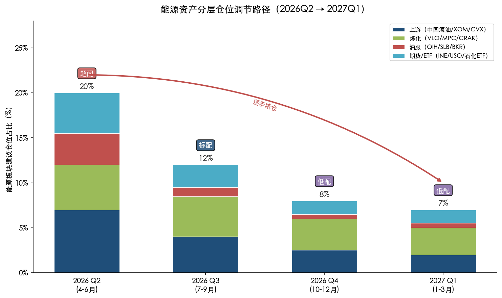

上图以分层堆叠柱状图展示了上游、炼化、油服、期货/ETF四个子板块在各季度的建议仓位占比变化，总仓位从Q2的超配20%逐步降至2027年Q1的低配7%，直观呈现"超配→标配→低配"的减仓节奏。

**Q2（4-6月）：** 维持能源板块超配。具体比例视投资者风险偏好而定——激进型可将能源仓位提升至组合的20-25%，稳健型建议控制在10-15%。Q2是地缘溢价和季节性需求的双重窗口期，持仓具备较高的正期望值。但须在布伦特接近95-100美元时建立止盈纪律。

**Q3（7-9月）：** 逐步将能源仓位从超配调降至标配。第3章数据显示，Q3供给剩余从Q2的72万桶/日陡升至222万桶/日，累库压力将实质性拖累油价。此阶段应优先减持高弹性标的（油服、OIH、纯上游E&P），保留低弹性标的（炼化、综合油企）。

**Q4至2027年：** 能源仓位进一步调降至低配。2027年布伦特中枢预计在60-70美元，较2026年均价下移约10-15%，上游企业盈利将明显收缩。但可在Q4油价若超调至65美元以下时考虑逆向加仓——第4章判断的60-80美元"合理中枢"意味着极端低价难以持续。

### 5.4.3 尾部风险的期权对冲

对于持有大量能源头寸的机构投资者，期权是管理尾部风险的核心工具。当前原油期权隐含波动率处于高位，直接买入put的成本偏高，更经济的替代方案包括：

**Collar策略（领口策略）：** 持有原油多头的同时，买入虚值put（如WTI 75美元put）并卖出虚值call（如WTI 110美元call），构建零成本或低成本的保护区间。这一策略在第4章判断的"Q2天花板100美元、Q4回落至70-75美元"路径下，可有效保护下行风险的同时保留合理的上行空间。

**跨市场对冲：** 持有A股"三桶油"多头的投资者，可考虑在INE原油期货上建立少量空头，利用原油价格下跌时的期货盈利对冲股票端的亏损。但需注意基差风险——A股能源股的涨跌幅度与国际原油价格之间的相关性虽高，但并非完美线性关系。

## 5.5 投资策略总览

综合以上分析，我们将核心配置建议凝练为以下框架。下图从"油价弹性"与"盈利确定性"两个维度，对本章涉及的主要标的与工具进行四象限定位，直观展示各资产的风险收益特征与配置方向。

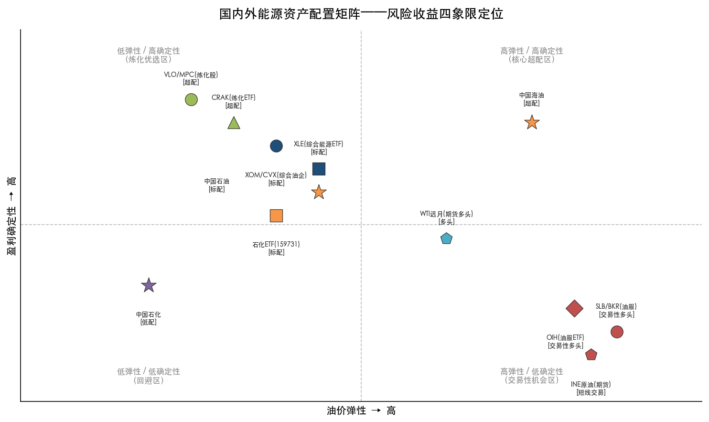

| 维度 | 标的/工具 | 策略方向 | 时间窗口 | 核心逻辑 |
|------|---------|---------|---------|---------|
| 海外期货 | WTI/Brent远月合约 | 多头 | 2027年12月合约 | 锚定基本面中枢，享受正展期收益 |
| 海外期货 | 近远月日历价差 | 做空价差（卖近买远） | Q2入场 | 地缘溢价消退后价差收窄 |
| 海外权益 | 炼化股（VLO/MPC/PSX） | 超配 | Q2-Q3 | 裂解价差结构性走阔，盈利确定性高 |
| 海外权益 | 综合油企（XOM/CVX） | 标配 | 全年 | 高分红+低估值保护，但追高空间有限 |
| 海外权益 | 油服（SLB/BKR） | 交易性多头 | Q2减持 | 高弹性但均值回归风险大 |
| A股权益 | 中国海油 | 超配 | 全年 | 桶油成本最低，油价弹性最大，股息率高 |
| A股权益 | 中国石油 | 标配 | 全年 | 全产业链对冲，攻守兼备 |
| A股权益 | 中国石化 | 低配 | 观望 | 下游成本压力大，盈利确定性弱 |
| A股ETF | 石化ETF（159731） | 标配 | 全年 | 全产业链分散化配置 |
| 期货工具 | INE原油期货 | 短线交易 | Q2 | 专业投资者限定，严控杠杆 |
| 对冲工具 | WTI put期权 | 保护性买入 | Q2持有 | 对冲地缘溢价快速消退风险 |

在这一框架下，能源资产的配置逻辑可归结为一句话：**短期逐利地缘溢价，中期锚定基本面回归，全程以对冲纪律控制尾部风险。** 当前布伦特104美元的价格内嵌了约25-32美元的战争溢价——这部分溢价既是短期的利润来源，也是中期的风险敞口。投资者的核心任务，是在溢价消退之前完成从"进攻"到"防御"的仓位转换。

# 结论与风险提示

## 核心结论

2026年3月油价飙升并非单一事件驱动的偶发行情，而是OPEC剩余产能结构性收窄、霍尔木兹海峡极端供给中断、全球利率路径"更高更久"锁定宏观空间、Non-OECD需求季节性回暖四重因素交互放大的结果。布伦特从72美元飙升至盘中119.50美元，本质上是"薄缓冲"市场遭遇"极端冲击"的非线性价格反应。

展望后续走势，我们维持"Q2见顶、下半年回落、2027年中枢下移"的核心判断。三个核心论据支撑这一路径：

**第一，地缘溢价终将消退。** 当前约104美元的价格水平内嵌25-32美元/桶的战争溢价。历史经验表明，涉及军事冲突的供给冲击在通行恢复或停火达成后，价格通常在3-6个月内回归基本面水平。1990年海湾战争、2022年俄乌冲突均遵循这一规律。3月28日谈判进展及霍尔木兹海峡通行恢复进度，是判断溢价消退速度的关键观测变量。

**第二，基本面供过于求的格局高度确定。** EIA和IEA均预测2026年全年供给增速约为需求增速的两倍。Q3-Q4供给剩余将急剧扩大至222-330万桶/日，OECD商业库存全年净增约1亿桶。OPEC+增产叠加巴西、圭亚那、阿根廷等Non-OPEC新兴产油国的持续扩张，构成供给端双线压力。需求端，中国石油消费增长趋近"天花板"（S&P Global预计仅+1%），印度虽接力但体量尚不足以替代。

**第三，合理价格中枢存在"硬约束"。** 沙特财政盈亏平衡油价约80-85美元/桶构成政策上边界，美国页岩油全周期成本45-55美元/桶构成生产下边界。两重约束框定的合理中枢区间为60-80美元/桶。当前104美元远超该区间上沿，回归压力明确。

投资层面，布伦特Q2均价预计85-95美元、Q4回落至70-80美元、2027年均价约65美元的概率加权路径，指向"短期超配、中期标配、远期低配"的仓位节奏。海外炼化板块受裂解价差走阔驱动，盈利确定性高于上游，是结构性超配方向；A股"三桶油"中，中国海油以最低桶油成本和最大油价弹性居配置首位；期货策略宜关注陡峭backwardation结构下的日历价差做空和远月多头机会。全程配合put期权或collar策略管理地缘尾部风险。

## 风险提示

**1. 霍尔木兹海峡长期关闭风险。** 若海峡通行中断持续超过6个月，Fitch Ratings警告布伦特年均价可能达到120美元/桶，危机期间峰值或触及130-170美元，将显著改变本报告的基准路径假设。该情景概率约15%。

**2. 冲突进一步升级风险。** 伊朗Kharg岛（承载其90%以上石油出口）基础设施若遭打击，或伊朗对沙特、阿联酋石油设施发起报复性攻击，将造成供给端结构性损毁，油价可能突破2008年历史峰值。该情景概率约5%，但冲击烈度极高。

**3. 全球经济衰退风险。** 高油价与高利率的双重挤压可能导致美国GDP增速骤降至1%以下，叠加欧洲和中国经济走弱，全球石油需求出现负增长。在此情景下，布伦特可能跌破60美元甚至接近50美元，能源股估值将面临深度调整。

**4. OPEC+配额纪律崩溃风险。** 哈萨克斯坦、伊拉克等成员国长期超产问题尚未根本解决。若地缘溢价消退后OPEC+内部配额博弈激化，供给失控将加速油价向下超调，市场可能短暂测试60美元以下区域。

**5. 人民币汇率波动风险。** A股石油石化板块盈利部分取决于原油进口成本的人民币计价。人民币对美元汇率大幅波动将影响"三桶油"的汇兑损益及进口成本核算，投资者需关注中美利差变化对汇率的传导效应。
