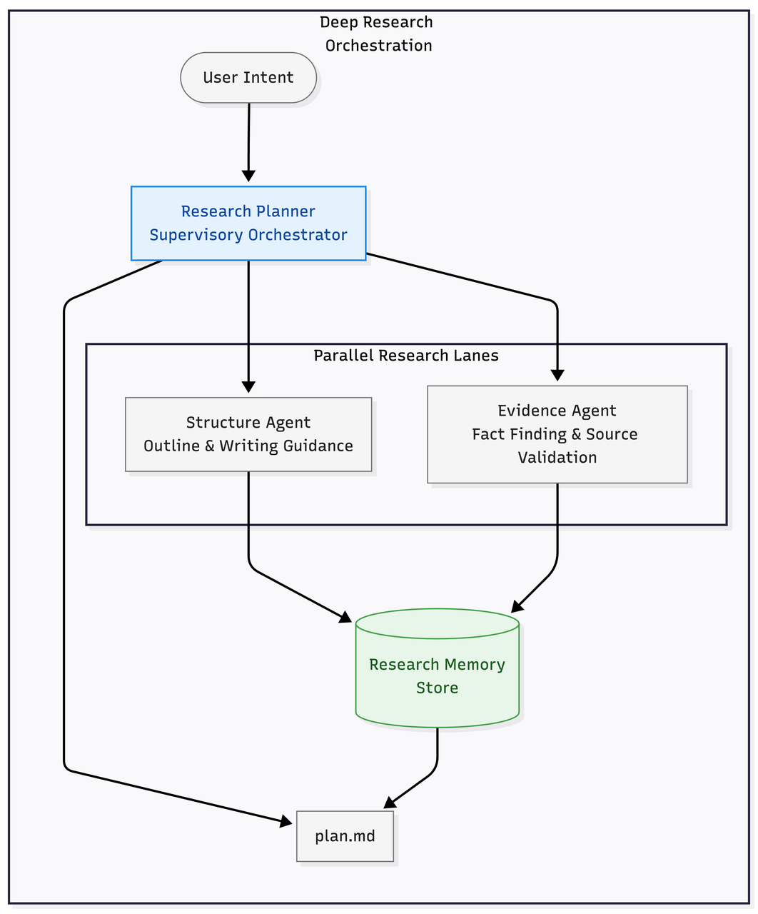
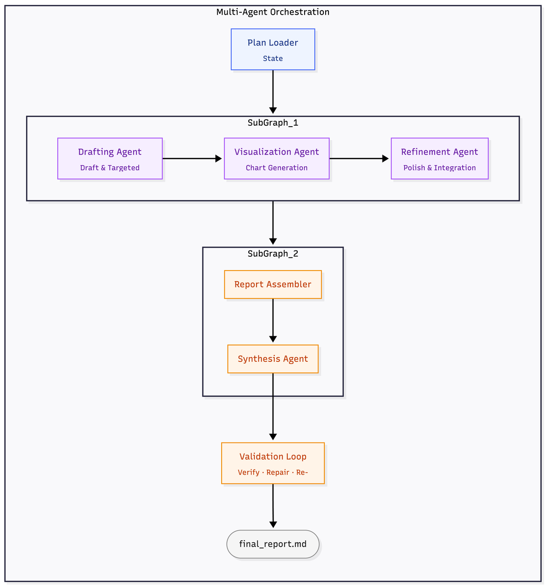

# FinWrite — AI Multi-Agent Financial Research Report Generation

> 基于 Plan-Execute 双阶段智能体集群架构，端到端生成机构级金融研究报告。

本仓库是 **FinWrite** 系统的产出物存档。`default/` 目录包含一份完整的原油市场深度研报——从结构化研究计划到最终交付的五章正文，全部由多智能体协作管线自动生成。

---

## 系统架构

FinWrite 的设计灵感来源于 Claude Code 等前沿 AI 编程系统：金融研报基于本地知识库与互联网权威信源完成长文写作，正如 Claude Code 基于本地代码库完成长代码写作；研报需要将图表精确嵌入合理的文章位置，正如代码编辑需要将修改精确应用到合理的代码位置。

系统采用 **Plan-Execute 双阶段智能体集群架构**，将研报生成拆为两个独立阶段：

### Phase 1: Plan — 深度研究与结构化规划

集成 DeepResearch 技术方案思路，由 Planner 智能体编排 Researcher 与 General-Purpose 子智能体集群，完成多轮信息检索、交叉验证与知识缺口分析，输出结构化大纲（章节目录 + 核心论点 + 关键数据 + 待补缺口）。



### Phase 2: Execute — 确定性编排图驱动的多智能体写作

采用 **Multi-Agent Orchestration Graph**（多智能体编排图），借鉴 LangGraph 的 stateful workflow、subgraph、durable execution 与 validation-driven control 设计思想，将「逐章写作 → 全局装配 → 最终校验」拆解为可控的执行图：

- **外层路径保持确定性**——保证流程稳定、便于调试与复现
- **内层节点保留有限 agentic 能力**——用于定向补研、图表生成与局部优化

相比开放式多智能体协作，这种设计在 **可控性、可调试性与生产环境长流程交付** 方面具备显著优势。



---

## 产出物结构

```
default/
├── plan.md                  # 结构化研究计划
├── final_report.md          # 最终交付报告（五章完整正文）
├── chapters/                # 各章独立 Markdown 文件
│   ├── chapter_01.md
│   ├── chapter_02.md
│   ├── chapter_03.md
│   ├── chapter_04.md
│   └── chapter_05.md
└── assets/                  # 图表与参考资料
    ├── chapter_0X/          # 各章智能体生成的 Matplotlib 图表
    └── data/images/         # 引用的外部参考资料截图
```

---

## 示例报告

本次生成的示例为 **《2026年全球原油市场深度研究报告》**，覆盖：

1. 行情回顾——从长周期下行到地缘冲击性飙升
2. 地缘冲击与宏观传导——美以打击伊朗的多维影响
3. 供需基本面——结构性过剩下的价格天花板
4. 价格展望与情景分析——Q2见顶、下半年回落
5. 投资策略与资产配置——跨市场能源资产配置框架

---

*Powered by FinWrite Multi-Agent System*
